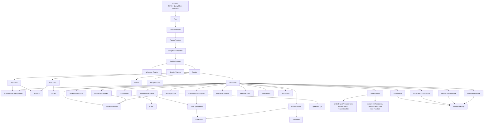

# Frontend Components & Design System

This document maps the React frontend under `frontend/src` — its pages, shared components, the canvas rendering layer, the configure/domain-selection UI, the component hierarchy, the design system, and the state/data-flow plumbing. The app is a Vite + React 19 single-page application that visualizes PDDL classical-planning trajectories as animated canvas frames, with both hand-coded renderers and LLM-generated ones. Routing is done with `wouter`, server communication with tRPC + TanStack Query, and styling with Tailwind CSS v4 (config lives in CSS, not a `tailwind.config.*` file). Every claim below cites the source line range it was read from; anything that could not be confirmed from a file is collected under "Unverified / TODO" at the end.

The entry point `frontend/src/main.tsx` mounts `<App/>` inside a tRPC provider and a TanStack `QueryClientProvider`, wiring a `splitLink` so mutations go through an un-batched `httpLink` (POST) and queries through `httpBatchLink`, both pointed at `/api/trpc` with `superjson` transform and `credentials: "include"` ([main.tsx:50-77](frontend/src/main.tsx#L50-L77)). It also subscribes to the query/mutation caches to redirect to login on an unauthorized error ([main.tsx:13-38](frontend/src/main.tsx#L13-L38)). `App.tsx` wraps everything in an `ErrorBoundary`, `ThemeProvider` (default `dark`), `StudyModeProvider`, `TooltipProvider`, a `Toaster`, and a fire-once `SessionTracker`, then renders the `Router` ([App.tsx:59-76](frontend/src/App.tsx#L59-L76)). The routes are `/` → `Welcome`, `/visualizer` → `Visualizer`, `/verifier` → `Verifier`, `/study-results` → `StudyResults`, and a catch-all `NotFound` ([App.tsx:40-52](frontend/src/App.tsx#L40-L52)).

## 1. Page-level components

**Welcome (`frontend/src/pages/Welcome.tsx`)** is the marketing/landing page and the app's `/` route. It is a self-contained file of decorative sub-components — `ScrollProgress`, `StickyNav`, `BrandMark`, `TypingEyebrow`, `RevealHeadline`, `CountUp`, `StatStrip`, `DomainChips`, `BlockStackIcon`, `SearchGraphIcon`, `PlaybackIcon`, and `Step` — all defined locally ([Welcome.tsx:21-493](frontend/src/pages/Welcome.tsx#L21-L493)). It leans heavily on `framer-motion` (`useReducedMotion`, `useScroll`, `useSpring`, `useTransform`) ([Welcome.tsx:1-9](frontend/src/pages/Welcome.tsx#L1-L9)) and renders a full-bleed animated hero that layers the shared `PDDLHeaderBackground` in `welcome-hero` mode behind centered summary content ([Welcome.tsx:631-679](frontend/src/pages/Welcome.tsx#L631-L679)). Its only real state is the facilitator study-intake flow: `showStudyPrompt` plus an `intake` object (participantId, profile, studyDate, facilitator, noteTaker, mode) that, on `beginStudy`, calls `startSession` from `useStudyMode` and navigates to `/visualizer` ([Welcome.tsx:566-584](frontend/src/pages/Welcome.tsx#L566-L584)). `Enter`/`⌘K` jump straight to the visualizer ([Welcome.tsx:587-601](frontend/src/pages/Welcome.tsx#L587-L601)), and a button navigates to `/study-results` ([Welcome.tsx:1037](frontend/src/pages/Welcome.tsx#L1037)). It makes **no tRPC calls**.

**Visualizer (`frontend/src/pages/Visualizer.tsx`)** is the heart of the app at ~2,400 lines and the most state-heavy page. It owns the full configure → solve → render → playback → feedback workflow. Its main state includes the selected domain/strategy/problem inputs, the generated trajectory (`renderedStates`, `rawStates`, `plan`, `currentStateIndex`, `predicateSchema`, `pddlObjects`, `problemHash`), processing flags, the render-mode trio (`renderMode`, `llmProvider`, `llmRendererCode`, `llmTransformerCode` and their generating/error flags), and the custom-domain set (`isCustomDomain`, `customMode`, `selectedSavedDomainId`, plus separate file/text inputs for domain and problem PDDL) ([Visualizer.tsx:569-695](frontend/src/pages/Visualizer.tsx#L569-L695)). A `vizRunId` counter is bumped on each new plan to remount the canvas and reset zoom/pan ([Visualizer.tsx:1033](frontend/src/pages/Visualizer.tsx#L1033)). It defines the built-in `domains` list (blocks-world, gripper, depot, hanoi, rovers, satellite) and their per-domain `domainColors` palette inline ([Visualizer.tsx:849-865](frontend/src/pages/Visualizer.tsx#L849-L865)).

The Visualizer drives many tRPC calls: `events.logEvent` (telemetry), `verifier.verifyState` (auto-verify), `visualizer.listStrategies`, `visualizer.listSavedDomains`, `visualizer.loadSavedDomain`, `verifier.existingResultsForTrajectory`, `visualizer.saveDomainToLibrary`, `visualizer.deleteSavedDomain`, `visualizer.getDomainDefinition`, `visualizer.uploadAndGenerate`, `visualizer.llmGenerateRenderer`, `visualizer.uploadAndGenerateCustom`, `visualizer.llmGenerateTransformer`, and `visualizer.cancelSolve` ([Visualizer.tsx:571-1360](frontend/src/pages/Visualizer.tsx#L571-L1360)). Some cache lookups are made with raw `fetch` against `/api/trpc/...` GET endpoints rather than the React hook — e.g. `lookupBasicRenderer` for cache-first LLM reuse ([Visualizer.tsx:1116-1135](frontend/src/pages/Visualizer.tsx#L1116-L1135)) and `lookupSavedDomainByPddl` for duplicate detection ([Visualizer.tsx:1255-1284](frontend/src/pages/Visualizer.tsx#L1255-L1284)). It renders nearly every shared component: `PDDLHeaderBackground`, `SusSurvey`, `CollapseSection`, `DomainGrid`, `SavedDomainsList`, `SavedDomainDetail`, `CustomDomainUpload`, `ProblemInput`, `StrategyPicker`, `RenderModePicker`, `SpeedBadge`, `StateCanvas`, `PlaybackControls`, `FeedbackBox`, `VerifyStatus`, `ErrorModal`, `DuplicateDomainModal`, `DeleteDomainModal`, and two `PddlViewerModal`s, plus the local `AmbientOrbs`, `PlanningGraph`, `ScanBeam`, `StepPill`, and `FloatingParticles` decorations ([Visualizer.tsx:1488-2419](frontend/src/pages/Visualizer.tsx#L1488-L2419)). Playback is delegated to the `usePlayback` hook and the `PlaybackControls` component ([Visualizer.tsx:6-7](frontend/src/pages/Visualizer.tsx#L6-L7), [Visualizer.tsx:2184-2195](frontend/src/pages/Visualizer.tsx#L2184-L2195)).

**Verifier (`frontend/src/pages/Verifier.tsx`)** is a read-only report page for the `/verifier` route. It calls the single query `verifier.aggregateWithFeedback` ([Verifier.tsx:72](frontend/src/pages/Verifier.tsx#L72)) and presents a method → domain → version → problem → state drill-down. Its state is just the active method tab (`basic`/`claude`/`gemini`) and two `Set`s tracking which domains/problems are expanded ([Verifier.tsx:67-70](frontend/src/pages/Verifier.tsx#L67-L70)). It renders per-method precision/recall/human-rating summaries via the local `AvgTrio` helper, and at the leaf level shows the captured state screenshot alongside agent precision/recall (TP/FP/FN, missing/extra predicates) and the human rating with a descriptor/color scale ([Verifier.tsx:39-65](frontend/src/pages/Verifier.tsx#L39-L65), [Verifier.tsx:220-308](frontend/src/pages/Verifier.tsx#L220-L308)).

**StudyResults (`frontend/src/pages/StudyResults.tsx`)** is the `/study-results` SUS dashboard. It calls `sus.listSus` ([StudyResults.tsx:31-32](frontend/src/pages/StudyResults.tsx#L31-L32)), sorts rows by submission time, and computes a summary (participant count, mean SUS, percent ≥ 70) ([StudyResults.tsx:42-49](frontend/src/pages/StudyResults.tsx#L42-L49)). It renders three summary cards and a wide table of participant rows, and has a client-side CSV export (`handleExportCsv`) that flattens the 10 SUS items plus the exit-interview fields into a downloadable blob ([StudyResults.tsx:54-107](frontend/src/pages/StudyResults.tsx#L54-L107)). It uses `useLocation` from `wouter` to navigate home.

**NotFound (`frontend/src/pages/NotFound.tsx`)** is the catch-all 404 page. It is the one page styled in the *light* palette (a slate gradient with a `Card`), uses the `lucide-react` `AlertCircle`/`Home` icons, and a single "Go Home" `Button` that calls `setLocation("/")` ([NotFound.tsx:6-50](frontend/src/pages/NotFound.tsx#L6-L50)). It is the only page that consumes the shadcn-style `Button`/`Card` primitives.

## 2. Reusable / shared components

The component inventory below records each shared component's props and role; detailed prose for the notable ones follows.

| Component | File | Key props (from source) | Renders / role |
|---|---|---|---|
| `CollapseSection` | components/CollapseSection.tsx | `open: boolean; children` ([:4](frontend/src/components/CollapseSection.tsx#L4)) | Animated height collapse wrapper for sidebar sections |
| `ModalBackdrop` | components/ModalBackdrop.tsx | `children; onClose` ([:6](frontend/src/components/ModalBackdrop.tsx#L6)) | Dimmed full-screen backdrop + spring-animated centered card |
| `PillToggle<T>` | components/PillToggle.tsx | `options: {id:T;label:ReactNode}[]; value:T; onChange` ([:1-5](frontend/src/components/PillToggle.tsx#L1-L5)) | Generic segmented pill toggle |
| `SpeedBadge` | components/SpeedBadge.tsx | `speed: string` ([:4](frontend/src/components/SpeedBadge.tsx#L4)) | fast/medium/slow speed pill with icon |
| `DomainGrid` | components/DomainGrid.tsx | `domains; selectedDomain; domainColors; onSelect; onViewDefinition` ([:24-31](frontend/src/components/DomainGrid.tsx#L24-L31)) | Built-in domain list (Step 1, Basic mode) |
| `ProblemInput` | components/ProblemInput.tsx | `domainName; problemType; inputMode; problemFile/Text + setters; onViewExample` ([:10-22](frontend/src/components/ProblemInput.tsx#L10-L22)) | Step 2: example vs custom problem, file/text input |
| `PddlUploadField` | components/PddlUploadField.tsx | `label; inputMode; file/text + setters; uploadHint; textPlaceholder` ([:6-17](frontend/src/components/PddlUploadField.tsx#L6-L17)) | Reusable upload-vs-paste PDDL field |
| `CustomDomainUpload` | components/CustomDomainUpload.tsx | provider + domain/problem PDDL inputs ([:12-31](frontend/src/components/CustomDomainUpload.tsx#L12-L31)) | "Upload New" custom-domain panel |
| `StrategyPicker` | components/StrategyPicker.tsx | `isOpen; onToggle; strategies; selectedStrategy; onSelect; currentStrategy` ([:17-25](frontend/src/components/StrategyPicker.tsx#L17-L25)) | Step 3: Fast Downward strategy chooser |
| `RenderModePicker` | components/RenderModePicker.tsx | `isCustomDomain; isOpen; renderMode; llmProvider; onGenerate; isGenerating; rendererCode; modelInfo; error` ([:11-25](frontend/src/components/RenderModePicker.tsx#L11-L25)) | Basic-vs-LLM render mode + provider + generate |
| `SavedDomainsList` | components/SavedDomainsList.tsx | `savedDomains; isLoading; selectedSavedDomainId; onSelect; onDelete` ([:14-22](frontend/src/components/SavedDomainsList.tsx#L14-L22)) | Saved-domain library rows |
| `SavedDomainDetail` | components/SavedDomainDetail.tsx | domain PDDL + transformer/renderer code + problem input ([:13-29](frontend/src/components/SavedDomainDetail.tsx#L13-L29)) | Detail panel for a selected saved domain |
| `PlaybackControls` | components/PlaybackControls.tsx | `currentStateIndex; totalStates; isPlaying; playbackSpeed; onPrevious/Play/Pause/Next/Seek/SpeedChange` ([:23-34](frontend/src/components/PlaybackControls.tsx#L23-L34)) | Transport bar: prev/play/next, scrubber, speed |
| `FeedbackBox` | components/FeedbackBox.tsx | `context: FeedbackContext; getImageDataUrl; disabled?` ([:22-28](frontend/src/components/FeedbackBox.tsx#L22-L28)) | 1–5 rating + comment, submits with canvas PNG |
| `VerifyStatus` | components/VerifyStatus.tsx | `applicable; entry: VerifyEntry|null; stateIndex` ([:26-33](frontend/src/components/VerifyStatus.tsx#L26-L33)) | One-line agent verification status under canvas |
| `ErrorModal` | components/ErrorModal.tsx | `state: ErrorModalState; onClose; onSwitchDomain` ([:14-19](frontend/src/components/ErrorModal.tsx#L14-L19)) | Error / domain-mismatch dialog with suggested-domain switch |
| `DuplicateDomainModal` | components/DuplicateDomainModal.tsx | `show; matches; onDismiss; onReuse; onCreateNew` ([:15-23](frontend/src/components/DuplicateDomainModal.tsx#L15-L23)) | "Domain already exists" reuse-or-create chooser |
| `DeleteDomainModal` | components/DeleteDomainModal.tsx | `show; displayName; isDeleting; onCancel; onConfirm` ([:5-11](frontend/src/components/DeleteDomainModal.tsx#L5-L11)) | Destructive saved-domain delete confirmation |
| `PddlViewerModal` | components/PddlViewerModal.tsx | `show; onClose; title; subtitle?; children` ([:5-12](frontend/src/components/PddlViewerModal.tsx#L5-L12)) | Generic scrollable PDDL/text viewer modal |
| `SusSurvey` | components/SusSurvey.tsx | `open; intake; startedAt; onClose; onFinished` ([:33-43](frontend/src/components/SusSurvey.tsx#L33-L43)) | In-app 10-item SUS + exit interview |
| `ErrorBoundary` | components/ErrorBoundary.tsx | `children` ([:6-8](frontend/src/components/ErrorBoundary.tsx#L6-L8)) | Class component; catches React crashes, logs `app_crash` |
| `StateCanvas` | components/StateCanvas.tsx | `state; width?; height?; isFirst?; isLast?; llmRendererCode?; transformerCode?; onLlmError?` ([:103-115](frontend/src/components/StateCanvas.tsx#L103-L115)) | The canvas renderer (see §3) |
| `Icons` | components/Icons.tsx | n/a (33 SVG icon exports) | Icon set incl. domain icons + `ClaudeIcon`/`GeminiIcon` ([:12-351](frontend/src/components/Icons.tsx#L12-L351)) |
| `PDDLHeaderBackground` | components/PDDLHeaderBackground.tsx | `left?; view?: "full"|"code"|"scene"|"welcome-hero"` ([:20-33](frontend/src/components/PDDLHeaderBackground.tsx#L20-L33)) | Animated canvas backdrop (PDDL dissolve + blocks scene) |

The configure-sidebar pieces are deliberately presentational — they hold no server state and receive everything via props from the Visualizer. `DomainGrid` maps the `Domain[]` list (each with `id/name/description/Icon`) into animated buttons, coloring the selected one from the `DomainColors` record and rendering a "View Domain Definition" button ([DomainGrid.tsx:5-31](frontend/src/components/DomainGrid.tsx#L5-L31), [DomainGrid.tsx:46-89](frontend/src/components/DomainGrid.tsx#L46-L89)). `PddlUploadField` is the shared primitive for PDDL input, toggling between a dashed-border file dropzone (`accept=".pddl,.txt"`) and a paste `Textarea` ([PddlUploadField.tsx:44-59](frontend/src/components/PddlUploadField.tsx#L44-L59)); both `CustomDomainUpload` and `SavedDomainDetail` compose it for their domain/problem inputs ([CustomDomainUpload.tsx:96-117](frontend/src/components/CustomDomainUpload.tsx#L96-L117), [SavedDomainDetail.tsx:121-131](frontend/src/components/SavedDomainDetail.tsx#L121-L131)). `StrategyPicker` renders the strategy list returned by `listStrategies`, badging each as Optimal/Satisficing plus a `SpeedBadge`, and surfaces a warning panel for the current strategy ([StrategyPicker.tsx:58-100](frontend/src/components/StrategyPicker.tsx#L58-L100)).

`PlaybackControls` is purely a transport surface — prev/play-pause/next buttons, a `<input type="range">` scrubber, an `AnimatedNumber` step counter that smoothly counts via a framer-motion motion value, and a speed slider whose value is inverted (`2200 - playbackSpeed`) so dragging right means faster ([PlaybackControls.tsx:8-21](frontend/src/components/PlaybackControls.tsx#L8-L21), [PlaybackControls.tsx:84-105](frontend/src/components/PlaybackControls.tsx#L84-L105)). `FeedbackBox` is per-state: it resets whenever `stateIndex`/`rendererHash`/`transformerHash` change, requires a comment for any rating below 5, captures the live canvas as a PNG via `getImageDataUrl`, and submits through `feedback.submitFeedback` spread with the `FeedbackContext` ([FeedbackBox.tsx:50-88](frontend/src/components/FeedbackBox.tsx#L50-L88)). `VerifyStatus` is a thin presenter over a `VerifyEntry` union (`pending` / `done` with precision-recall-cacheHit / `error`) and renders nothing when verification is not applicable (basic mode / pre-baked examples) ([VerifyStatus.tsx:13-41](frontend/src/components/VerifyStatus.tsx#L13-L41)).

All four dialogs share `ModalBackdrop`, which provides the dimmed click-to-close backdrop and the spring-in card ([ModalBackdrop.tsx:6-17](frontend/src/components/ModalBackdrop.tsx#L6-L17)). `ErrorModal` switches amber styling for `*mismatch` error types and offers a one-click "Switch to <suggested domain>" button ([ErrorModal.tsx:24-62](frontend/src/components/ErrorModal.tsx#L24-L62)); `DuplicateDomainModal` lists matching saved-domain versions (with truncated transformer/renderer hashes) to reuse or "Create new version" ([DuplicateDomainModal.tsx:51-112](frontend/src/components/DuplicateDomainModal.tsx#L51-L112)); `DeleteDomainModal` is the destructive confirm; `PddlViewerModal` is the generic scrollable viewer used for both "Example Problem" and "Domain Definition" ([PddlViewerModal.tsx:16-49](frontend/src/components/PddlViewerModal.tsx#L16-L49)). `SusSurvey` holds the validated ten SUS statements verbatim and a 5-point scale, collects answers + an optional exit interview (use cases / suggestions / overall impression), computes a duration from `startedAt`, and submits via `sus.submitSus` ([SusSurvey.tsx:10-29](frontend/src/components/SusSurvey.tsx#L10-L29), [SusSurvey.tsx:64-90](frontend/src/components/SusSurvey.tsx#L64-L90)). `ErrorBoundary` is the only class component; on a caught render error it POSTs an `app_crash` event to `/api/trpc/events.logEvent` (manually wrapping the input in superjson's `{ json: ... }` envelope) and shows a reload screen ([ErrorBoundary.tsx:25-50](frontend/src/components/ErrorBoundary.tsx#L25-L50)).

`Icons.tsx` exports 33 hand-rolled SVG icon components, including the six domain icons (`BlocksWorldIcon`, `GripperIcon`, `DepotIcon`, `HanoiIcon`, `RoverIcon`, `SatelliteIcon`) and provider marks (`ClaudeIcon`, `GeminiIcon`) ([Icons.tsx:214-351](frontend/src/components/Icons.tsx#L214-L351)). `PDDLHeaderBackground` is a large (642-line) animated `<canvas>` backdrop driven by a `view` prop (`full`/`code`/`scene`/`welcome-hero`) that dissolves PDDL code into a blocks-world scene with flying particle bubbles ([PDDLHeaderBackground.tsx:20-36](frontend/src/components/PDDLHeaderBackground.tsx#L20-L36), [PDDLHeaderBackground.tsx:86-88](frontend/src/components/PDDLHeaderBackground.tsx#L86-L88)).

### ui/ primitives (shadcn-style)

The `frontend/src/components/ui/` directory holds shadcn/Radix-style primitives, but most are scaffolding that the app does not actually import. A search of `frontend/src` shows only five are used: `sonner` (`Toaster`) and `tooltip` (`TooltipProvider`) in `App.tsx`, `button` (`Button`) in `NotFound.tsx`/`Welcome.tsx`, `card` (`Card`/`CardContent`) in `NotFound.tsx`, and `textarea` (`Textarea`) in `PddlUploadField.tsx`/`ProblemInput.tsx`. `Button` is a `class-variance-authority` (cva) component with `default/destructive/outline/secondary/ghost/link` variants and `default/sm/lg/xl/icon/icon-sm/icon-lg` sizes, supporting Radix `Slot` via `asChild` ([ui/button.tsx:7-39](frontend/src/components/ui/button.tsx#L7-L39)). `sonner`'s `Toaster` reads `next-themes` and binds its colors to the popover CSS variables ([ui/sonner.tsx:1-21](frontend/src/components/ui/sonner.tsx#L1-L21)). The remaining primitives — `dialog`, `input`, `label`, `separator`, `sheet`, `skeleton`, `toggle` — export their components but have no importers in `frontend/src` (see Unverified / TODO).

## 3. The canvas rendering layer

`StateCanvas` is where a `RenderedState` (`{ domain, objects[], relations[], metadata }` — [StateCanvas.tsx:90-95](frontend/src/components/StateCanvas.tsx#L90-L95)) becomes pixels. It maintains per-instance zoom/pan in a `viewRef` mirrored into React state, attaches a non-passive native `wheel` listener so it can `preventDefault` page scroll while zooming toward the cursor, and supports drag-to-pan ([StateCanvas.tsx:301-393](frontend/src/components/StateCanvas.tsx#L301-L393)). Because the parent keys it by `vizRunId`, a new plan remounts the component and resets the view ([StateCanvas.tsx:305-317](frontend/src/components/StateCanvas.tsx#L305-L317)).

The hand-coded renderers live in sibling files and are registered in a `domainRenderers` map keyed by domain name. `renderDepot`, `renderSatellite`, `renderHanoi`, and `renderRovers` are imported from `renderDepot.ts`/`renderSatellite.ts`/`renderHanoi.ts`/`renderRovers.ts` and registered with their `background`/`legend` companions at module load ([StateCanvas.tsx:2-5](frontend/src/components/StateCanvas.tsx#L2-L5), [StateCanvas.tsx:40-64](frontend/src/components/StateCanvas.tsx#L40-L64)); `blocks-world` and `gripper` are defined inside `StateCanvas.tsx` itself (`renderBlocksWorld` at [:749](frontend/src/components/StateCanvas.tsx#L749), `renderGripper` at [:899](frontend/src/components/StateCanvas.tsx#L899)) and registered at the bottom of the file ([StateCanvas.tsx:1244-1255](frontend/src/components/StateCanvas.tsx#L1244-L1255)). Each `DomainRenderer` is `{ render, background?, legend?, legendData? }`, where `legendData` (a `LegendEntry[]`) is the preferred HTML-legend form and the on-canvas `legend` function is a legacy fallback ([StateCanvas.tsx:14-28](frontend/src/components/StateCanvas.tsx#L14-L28)). The imaging domains (rovers, satellite) share an `IMAGING_LEGEND` data array ([StateCanvas.tsx:32-36](frontend/src/components/StateCanvas.tsx#L32-L36)). The renderer exports are: `renderHanoi`/`renderHanoiBackground` ([renderHanoi.ts:29,236](frontend/src/components/renderHanoi.ts#L29)), `renderDepot`/`renderDepotBackground` ([renderDepot.ts:27,483](frontend/src/components/renderDepot.ts#L27)), `renderSatellite`/`Background`/`Legend` ([renderSatellite.ts:404,798,848](frontend/src/components/renderSatellite.ts#L404)), and `renderRovers`/`Background`/`Legend` ([renderRovers.ts:354,677,724](frontend/src/components/renderRovers.ts#L354)).

The runtime-compile path turns LLM-generated source strings into callable functions. `compileLlmRenderer(code)` hashes the full code with a cyrb53 `hashCode` (caching in `llmRendererCache`), regex-scans for `render*` function names, wraps the code in a factory that collects those functions into an `__exports` object, evaluates it with `new Function(wrappedCode)`, and classifies the results: a `*legend*` export that is an array becomes `legendData`, a function becomes the legacy `legend`, `*background*` becomes `background`, and any other `render*` becomes the main `render` ([StateCanvas.tsx:139-240](frontend/src/components/StateCanvas.tsx#L139-L240)). `compileTransformer(code)` is the parallel path for state-enrichment code: it finds the first `transform*` function and returns it via `new Function`, caching in `transformerCache` ([StateCanvas.tsx:249-279](frontend/src/components/StateCanvas.tsx#L249-L279)). Both are best-effort and swallow compile errors so a bad artifact degrades rather than crashes.

The per-frame `useEffect` decides between hand-coded and LLM rendering. First it applies `transformerCode` (if any) to produce an `effectiveState`, guarding against a transformer that returns a non-state value or throws, with a final safety net that draws a neutral "No valid state" frame instead of letting a bad state reach the error boundary ([StateCanvas.tsx:405-442](frontend/src/components/StateCanvas.tsx#L405-L442)). Then it sets `useLlm = true` **only if** `llmRendererCode` was provided *and* `compileLlmRenderer` actually yielded a `render` function — otherwise it logs, calls `onLlmError`, and falls back ([StateCanvas.tsx:447-458](frontend/src/components/StateCanvas.tsx#L447-L458)). Drawing proceeds in layers: background (LLM background → domain background → `drawDefaultBackground`), then a `ctx.save()`/zoom-pan transform, then the main draw — the LLM renderer if active (wrapped in try/catch that falls back to `renderDefault` and reports via `onLlmError` on a crash), else the registered `domainConfig.render`, else explicit `blocks-world`/`gripper`/`renderDefault` fallbacks ([StateCanvas.tsx:463-509](frontend/src/components/StateCanvas.tsx#L463-L509)). The legend is drawn on-canvas only for the legacy path; renderers exposing `legendData` get an HTML legend panel (with `LegendSwatch` shapes) rendered in JSX instead ([StateCanvas.tsx:282-298](frontend/src/components/StateCanvas.tsx#L282-L298), [StateCanvas.tsx:511-518](frontend/src/components/StateCanvas.tsx#L511-L518)).

From the Visualizer's side, the choice is wired through props: `llmRendererCode` is passed only when `renderMode === "llm" && llmRendererCode` is set, and `transformerCode` only for custom domains, with `onLlmError` logging a `render_crash` telemetry event ([Visualizer.tsx:2157-2178](frontend/src/pages/Visualizer.tsx#L2157-L2178)). So the effective rule is: a built-in domain in Basic mode uses its hand-coded `domainRenderers[domain]`; switching to LLM mode (or selecting any custom domain, where LLM is automatic) passes generated code that wins *if it compiles to a valid render function*, otherwise the hand-coded/default renderer takes over.

## 4. The Configure / domain-selection UI

The configure sidebar lives inline in the Visualizer and is organized as numbered steps. Step 1 is the domain block, which opens with a `Basic` / `Custom` segmented toggle ([Visualizer.tsx:1691-1727](frontend/src/pages/Visualizer.tsx#L1691-L1727)). Clicking `Basic` clears custom state but deliberately keeps the current visualization on screen until the next Generate; clicking `Custom` sets `isCustomDomain` and blanks the selected built-in domain ([Visualizer.tsx:1698-1713](frontend/src/pages/Visualizer.tsx#L1698-L1713)). In Basic mode it renders `DomainGrid` with the six built-in domains; in Custom mode it renders a second `Saved Domains` / `Upload New` sub-toggle ([Visualizer.tsx:1730-1783](frontend/src/pages/Visualizer.tsx#L1730-L1783)).

Under Custom → Saved, a collapsible `SavedDomainsList` (backed by `listSavedDomains`, enabled only when `isCustomDomain`) lets the user pick or delete a saved entry; selecting one loads it via `loadSavedDomain` and shows a `SavedDomainDetail` panel with the domain PDDL, the cached transformer/renderer code, and a problem-PDDL input ([Visualizer.tsx:1815-1851](frontend/src/pages/Visualizer.tsx#L1815-L1851), [Visualizer.tsx:728-729](frontend/src/pages/Visualizer.tsx#L728-L729)). Under Custom → Upload New, `CustomDomainUpload` provides the LLM provider choice (Claude/Gemini), a domain-name field, and two `PddlUploadField`s for the domain and problem PDDL — each independently switchable between file upload and pasted text ([CustomDomainUpload.tsx:62-117](frontend/src/components/CustomDomainUpload.tsx#L62-L117)). For built-in domains, Step 2 is `ProblemInput`, which toggles between using the bundled example problem and supplying a custom one via file (`accept=".pddl"`) or pasted text ([Visualizer.tsx:1899-1910](frontend/src/pages/Visualizer.tsx#L1899-L1910), [ProblemInput.tsx:56-112](frontend/src/components/ProblemInput.tsx#L56-L112)); this whole step is hidden when a custom domain is selected ([Visualizer.tsx:1889-1913](frontend/src/pages/Visualizer.tsx#L1889-L1913)). Step 3 is `StrategyPicker`, fed by `strategiesQuery.data` (the Fast Downward strategies from `listStrategies`) ([Visualizer.tsx:1919-1926](frontend/src/pages/Visualizer.tsx#L1919-L1926)). The `RenderModePicker` (Basic vs LLM + provider + Generate) is rendered separately and is hidden entirely for custom domains because LLM rendering is automatic there ([Visualizer.tsx:1931-1944](frontend/src/pages/Visualizer.tsx#L1931-L1944), [RenderModePicker.tsx:56-58](frontend/src/components/RenderModePicker.tsx#L56-L58)).

PDDL is therefore providable through two mechanisms — file upload *and* text paste — exposed via the shared `PddlUploadField` (custom domain/problem) and the dedicated file/text branch in `ProblemInput` (built-in problems). The two-stage custom-domain generation chains automatically: `triggerTransformerGeneration` first looks up the saved-domain library by PDDL hash (`lookupSavedDomainByPddl`) and, on a hit, opens `DuplicateDomainModal` rather than calling the LLM; on a miss it runs `llmGenerateTransformer`, whose success handler pre-enriches sample states with the just-generated transformer and then auto-fires `llmGenerateRenderer` (Stage 2) ([Visualizer.tsx:1176-1293](frontend/src/pages/Visualizer.tsx#L1176-L1293)).

## 5. Component hierarchy

## 6. Design system

Styling is Tailwind CSS v4 configured entirely in `frontend/src/index.css` via `@import "tailwindcss"` and an `@theme inline` block — there is no `tailwind.config.*` file (PostCSS loads `@tailwindcss/postcss`, confirmed in `frontend/package.json` devDependencies). The `@theme inline` block maps Tailwind color utilities to CSS custom properties (e.g. `--color-primary: var(--primary)`) and defines a radius scale from `--radius: 0.625rem` ([index.css:6-43](frontend/src/index.css#L6-L43)). Real token values are declared twice — a light `:root` palette and a dark `.dark` palette — with dark being the app default (`ThemeProvider defaultTheme="dark"`). Dark mode is toggled by adding/removing the `.dark` class on `<html>` ([ThemeContext.tsx:32-43](frontend/src/contexts/ThemeContext.tsx#L32-L43)), and the custom variant `@custom-variant dark (&:is(.dark *))` drives Tailwind's `dark:` ([index.css:4](frontend/src/index.css#L4)).

Two fonts are imported from Google Fonts and used throughout: IBM Plex Sans for body text (set on `html`) and JetBrains Mono for the "terminal" UI accents (applied inline as `fontFamily: "'JetBrains Mono', monospace"` across the components) ([index.css:2](frontend/src/index.css#L2), [index.css:140-147](frontend/src/index.css#L140-L147)).

| Token | Light (`:root`) | Dark (`.dark`, default) | Source |
|---|---|---|---|
| `--primary` | `#4F46E5` (indigo) | `#22C55E` (terminal green) | [index.css:46,83](frontend/src/index.css#L46) |
| `--primary-foreground` | `#FFFFFF` | `#0B1524` | [index.css:47,84](frontend/src/index.css#L47) |
| `--background` | `#FAFBFC` | `#0B1524` | [index.css:49,89](frontend/src/index.css#L49) |
| `--foreground` | `#1F2937` | `#E2E8F0` | [index.css:50,90](frontend/src/index.css#L50) |
| `--card` | `#FFFFFF` | `#111E30` | [index.css:51,93](frontend/src/index.css#L51) |
| `--secondary` | `#F3F4F6` | `#1A2840` | [index.css:55,101](frontend/src/index.css#L55) |
| `--muted` | `#F9FAFB` | `#0F1A2E` | [index.css:57,103](frontend/src/index.css#L57) |
| `--muted-foreground` | `#6B7280` | `#64748B` | [index.css:58,104](frontend/src/index.css#L58) |
| `--accent` | `#EEF2FF` | `rgba(34,197,94,0.1)` | [index.css:59,107](frontend/src/index.css#L59) |
| `--accent-foreground` | `#4338CA` | `#4ADE80` | [index.css:60,108](frontend/src/index.css#L60) |
| `--destructive` | `#EF4444` | `#F87171` | [index.css:61,111](frontend/src/index.css#L61) |
| `--border` / `--input` | `#E5E7EB` | `rgba(255,255,255,0.07)` | [index.css:63-64,115-116](frontend/src/index.css#L63) |
| `--ring` | `#6366F1` | `#22C55E` | [index.css:65,117](frontend/src/index.css#L65) |
| `--chart-1..5` | `#6366F1` `#8B5CF6` `#22C55E` `#F59E0B` `#EF4444` | `#22C55E` `#6366F1` `#F59E0B` `#06B6D4` `#F87171` | [index.css:66-70,120-124](frontend/src/index.css#L66) |
| `--radius` | `0.625rem` | (same) | [index.css:48](frontend/src/index.css#L48) |
| Body font | IBM Plex Sans | (same) | [index.css:141](frontend/src/index.css#L141) |
| Mono/UI font | JetBrains Mono | (same) | [index.css:2](frontend/src/index.css#L2) |

Beyond tokens, `index.css` defines a sizable set of custom utilities and effects in `@layer components`: a responsive `.container`, technical `.bg-grid` / `.bg-dot-grid` backgrounds, a `.surface` card style, the glowing `.btn-primary-green` CTA (with an idle-glow keyframe), a `.badge`, custom scrollbar and `input[type=range]` thumb styling in the green accent, and a fixed `.scanlines` overlay ([index.css:183-323](frontend/src/index.css#L183-L338)). A library of keyframe animations (`fade-in`, `slide-up`, `scale-in`, `shimmer`, `glow-pulse`, `blink`, three `orb-drift-*`, `btn-idle-glow`, `step-pulse`) is exposed as `animate-*` / `orb-*` classes, and a `@media (prefers-reduced-motion: reduce)` block disables them ([index.css:340-455](frontend/src/index.css#L340-L455)). Shared framer-motion tokens (`easeOut`, `spring`, `fadeInUp`, `modalVariants`, `listStagger`, `listItem`) are centralized in `frontend/src/lib/animation.ts` and reused across the sidebar and modals ([lib/animation.ts:4-26](frontend/src/lib/animation.ts#L4-L26)).

The design primitives are Radix UI + shadcn-style cva components under `ui/` (see §2), but in practice the app's distinctive "terminal" look comes mostly from hand-written Tailwind classes and inline styles in each component rather than from the primitive set. `class-variance-authority`, `clsx`, and `tailwind-merge` provide the variant/merge tooling, the latter two via the `cn` helper ([lib/utils.ts:1-6](frontend/src/lib/utils.ts#L1-L6)).

## 7. State management & data flow

tRPC + TanStack Query is the data layer. `frontend/src/lib/trpc.ts` creates the typed client with `createTRPCReact<AppRouter>()`, importing the `AppRouter` type from the backend (`@server/routers`) so the whole API surface is type-checked end to end ([lib/trpc.ts:1-4](frontend/src/lib/trpc.ts#L1-L4)). The client and a `QueryClient` are instantiated in `main.tsx` and provided at the root; the `splitLink` routes mutations through an un-batched POST and queries through a batched GET, both with `superjson` and credentialed fetch ([main.tsx:50-77](frontend/src/main.tsx#L50-L77)). Vite proxies `/api` to the backend (`VITE_API_URL` or `http://localhost:4000`) during dev ([vite.config.ts](frontend/vite.config.ts)).

There is little global *client* state by design. Two React contexts hold cross-cutting concerns: `ThemeContext` (theme + optional toggle, persisted to `localStorage` only when `switchable`) and `StudyModeContext` (the facilitator study session — intake + `startedAt`, persisted to `sessionStorage` so a reload survives but a new tab starts clean) ([ThemeContext.tsx:19-56](frontend/src/contexts/ThemeContext.tsx#L19-L56), [StudyModeContext.tsx:44-97](frontend/src/contexts/StudyModeContext.tsx#L44-L97)). Telemetry uses a per-tab session id minted once and kept in `sessionStorage` ([lib/session.ts:20-33](frontend/src/lib/session.ts#L20-L33)). Everything else — the active trajectory, configure selections, render mode — is local `useState` inside the Visualizer.

The generation result flow is: the user clicks Generate, the Visualizer calls a mutation (`uploadAndGenerate` for built-ins, `uploadAndGenerateCustom` for custom domains), and the `onSuccess` handler writes the response into local state — `renderedStates`, `rawStates`, `plan`, `predicateSchema`, `pddlObjects`, `problemName`, `problemHash`, resets `currentStateIndex` to 0, and bumps `vizRunId` to remount the canvas ([Visualizer.tsx:1022-1043](frontend/src/pages/Visualizer.tsx#L1022-L1043), [Visualizer.tsx:1140-1164](frontend/src/pages/Visualizer.tsx#L1140-L1164)). From there `renderedStates[currentStateIndex]` flows into `StateCanvas` as its `state` prop, while `usePlayback` advances `currentStateIndex` on an interval that is recreated whenever `isPlaying`/`playbackSpeed` change so speed edits take effect mid-play ([usePlayback.ts:32-74](frontend/src/hooks/usePlayback.ts#L32-L74)). LLM rendering is a separate async chain: `llmGenerateTransformer` → (auto) `llmGenerateRenderer` populate `llmTransformerCode`/`llmRendererCode`, which are passed to the canvas; on success for new custom domains the artifacts are auto-saved via `saveDomainToLibrary` ([Visualizer.tsx:1074-1108](frontend/src/pages/Visualizer.tsx#L1074-L1108)). Downstream of a rendered frame, `FeedbackBox` submits a human rating + canvas PNG via `feedback.submitFeedback`, and an auto-verify effect calls `verifier.verifyState` per state, storing results in a `verifyByKey` map that `VerifyStatus` reads ([Visualizer.tsx:695-701](frontend/src/pages/Visualizer.tsx#L695-L701), [Visualizer.tsx:2222-2234](frontend/src/pages/Visualizer.tsx#L2222-L2234)). Auxiliary hooks round this out: `useIsMobile` (matchMedia at 768px), `useComposition` (IME-safe key handling), and `usePersistFn` (stable callback identity) ([useMobile.tsx:3-21](frontend/src/hooks/useMobile.tsx#L3-L21), [useComposition.ts:23-81](frontend/src/hooks/useComposition.ts#L23-L81), [usePersistFn.ts:8-20](frontend/src/hooks/usePersistFn.ts#L8-L20)).

## Unverified / TODO

- **Unused `ui/` primitives.** `ui/dialog.tsx`, `ui/input.tsx`, `ui/label.tsx`, `ui/separator.tsx`, `ui/sheet.tsx`, `ui/skeleton.tsx`, and `ui/toggle.tsx` export components but a `grep` of `frontend/src` found no importers. They are presumed unused scaffolding; their props were not documented in detail since they are not part of the live tree.
- **`@server/routers` alias.** `lib/trpc.ts` imports `AppRouter` from `@server/routers`; this alias is not declared in `vite.config.ts` (which only defines `@`), so it is presumably a `tsconfig.json` `paths` entry resolved at type-check time. The exact mapping was not read from `tsconfig.json`.
- **Internal renderer drawing logic.** The hand-coded renderers (`renderDepot.ts`, `renderRovers.ts`, `renderSatellite.ts`, `renderHanoi.ts`, and the in-file `renderBlocksWorld`/`renderGripper`) were confirmed by their exported signatures and registration, but their per-domain drawing internals were not read line-by-line.
- **`PDDLHeaderBackground` animation internals** were summarized from its prop/type declarations and `view`-mode branches, not from a full read of its 642-line animation loop.
- **SUS score formula.** `SusSurvey` collects ten answers and submits to `sus.submitSus`, which returns `res.score`; whether the standard SUS scoring is computed client-side or server-side was not fully traced (only the first ~90 lines of `SusSurvey.tsx` were read).

---

*Read-only compliance note: I created exactly one new file (`FRONTEND_COMPONENTS_AND_DESIGN.md` at the repo root), edited no existing files, and ran no git commands.*
