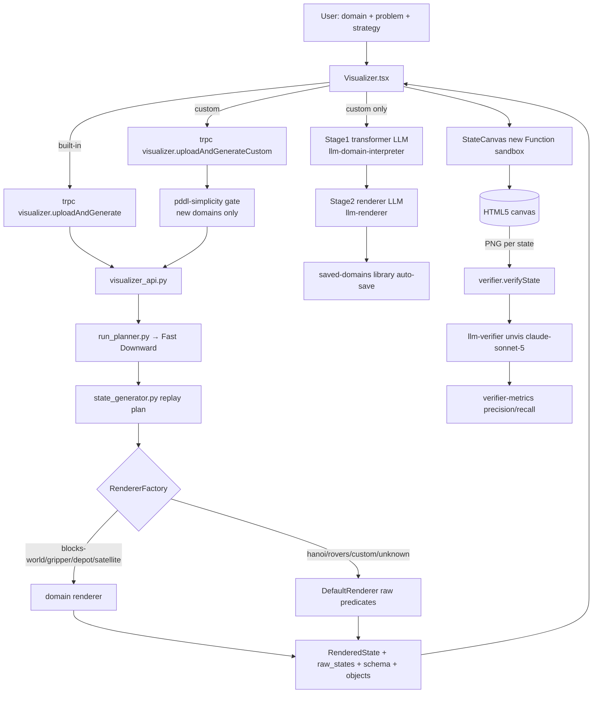

# Planning Visualizer — Code-Grounded Reference for Oral-Defense Q&A

> **One-liner.** A web app that runs the Fast Downward planner on PDDL problems, replays the plan into a sequence of logical states, and visualizes each state on an HTML5 canvas — with hand-coded renderers for six built-in domains and a **two-stage LLM pipeline** (Claude/Gemini + Anthropic Skills) that auto-generates a renderer for *any* uploaded custom domain. A vision-LLM "verifier" then re-reads each rendered image back into predicates and scores the visualization with precision/recall.

**Documented revision.** Branch `main`, commit `7d51665673e62eb389ffd2b698b1529d15440252` ("PlaybackControls"). Compiled 2026-06-23.

**Purpose of this file.** This is an exhaustive, source-cited map of every component, technology, workflow, design decision, evaluation result, and known weakness an examiner could probe. It is optimized for **completeness and for surfacing weak points**, not for polish. Every behavioral claim carries a `path:line` citation; anything not confirmable from source is tagged `[UNVERIFIED]`. Counts were re-derived from source code, and **every doc/code mismatch found is flagged explicitly** (see §7 and §10).

> **Note on the brief.** The task brief referenced a starting map `ARCHITECTURE_WORKFLOWS.md`; **that file does not exist** in this tree. The extant root docs are [README.md](README.md), [FRONTEND_COMPONENTS_AND_DESIGN.md](FRONTEND_COMPONENTS_AND_DESIGN.md), and [REORG_PROPOSAL.md](REORG_PROPOSAL.md). The brief also predicted a doc claiming "7 built-in domains"; **no committed `*.md` makes that claim** (grep of all docs is empty). The actual extant doc errors are different and are catalogued in §7.2.

---

## Table of Contents
0. [Header & verified-counts cheat-sheet](#0-verified-counts-cheat-sheet)
1. [System overview](#1-system-overview)
2. [Component inventory](#2-component-inventory)
3. [Technology stack](#3-technology-stack)
4. [Workflows (end-to-end)](#4-workflows-end-to-end)
5. [Design decisions & rationale](#5-design-decisions--rationale)
6. [Evaluation](#6-evaluation)
7. [Known limitations & open issues](#7-known-limitations--open-issues)
8. [Abandoned approaches](#8-abandoned-approaches)
9. [Glossary](#9-glossary)
10. [Anticipated examiner questions & evidence map](#10-anticipated-examiner-questions--evidence-map)

---

## 0. Verified-counts cheat-sheet

Every number below is re-derived **from source**, with the doc/code conflicts called out.

| Thing | Verified value | Source of truth |
|---|---|---|
| Built-in domains | **6**: blocks-world, gripper, depot, hanoi, rovers, satellite | [visualizer.ts:209-243](backend/api/visualizer.ts#L209-L243), [:265](backend/api/visualizer.ts#L265); [conftest.py:25-32](backend/planner/conftest.py#L25-L32) |
| Python renderer factory registrations | **4**: blocks-world, gripper, depot, satellite | [state_renderer/__init__.py:30-35](backend/planner/state_renderer/__init__.py#L30-L35) |
| Python renderers on disk but **NOT** registered | hanoi, rovers (→ `DefaultRenderer`) | [test_renderer_factory.py:50-54](backend/planner/tests/unit/test_renderer_factory.py#L50-L54); [REORG_PROPOSAL.md:316-341](REORG_PROPOSAL.md#L316-L341) |
| Frontend hand-coded renderers | **6** (all built-ins): blocks-world & gripper inline; depot/hanoi/rovers/satellite as files | [FRONTEND_COMPONENTS_AND_DESIGN.md:68](FRONTEND_COMPONENTS_AND_DESIGN.md#L68) |
| Search strategies (whitelist) | **7**; default `lazy-greedy-ff` | [search_strategies.py:31-116](backend/planner/search_strategies.py#L31-L116); [visualizer.ts:246-254](backend/api/visualizer.ts#L246-L254) |
| Top-level tRPC routers | **7**: system, visualizer, feedback, verifier, sus, events, auth | [routers.ts:11-27](backend/api/routers.ts#L11-L27) |
| tRPC procedures (total) | **≈32** (visualizer 15, verifier 7, feedback 3, sus 2, events 2, auth 2, system 1) | see §2.2 |
| Generation LLMs | Claude `claude-sonnet-5`; Gemini `gemini-2.5-pro` | [llm-renderer.ts:81-92](backend/api/llm-renderer.ts#L81-L92) |
| Verifier LLM | `claude-sonnet-5` (vision), default sampling (no temperature override) | [llm-verifier.ts:22-24](backend/api/llm-verifier.ts#L22-L24) |
| Anthropic betas | `code-execution-2025-08-25`, `skills-2025-10-02` | [llm-claude.ts:171](backend/api/llm-claude.ts#L171) |
| `new Function` sandbox sites | **3** | [StateCanvas.tsx:203](frontend/src/components/StateCanvas.tsx#L203), [:271](frontend/src/components/StateCanvas.tsx#L271), [Visualizer.tsx:1213](frontend/src/pages/Visualizer.tsx#L1213) |
| Backend TS tests | **65** cases / 7 files (52 unit + 13 integration) | §6.1 |
| Python tests (pytest-collected) | **56** (44 unit + 4 integration + 8 e2e) + 11 excluded standalone | §6.1 |
| Frontend tests | **8** vitest + **3** Playwright e2e | §6.1 |
| Committed verifier runs | **349** rows in `verifier_runs.jsonl` | [verifier-storage.ts:34](backend/api/verifier-storage.ts#L34); data file line count |
| Committed SUS responses | **1**; human feedback rows **13** | `data/sus_responses.jsonl`, `data/feedback.jsonl` |
| Planner timeout | **1800 s (30 min)**, env `PLANNER_TIMEOUT` | [run_planner.py:23-32](backend/planner/run_planner.py#L23-L32) |
| Simplicity gate caps (new custom domains) | objects ≤ 8, goal atoms ≤ 5, plan length ≤ 15 | [pddl-simplicity.ts:21-25](backend/api/pddl-simplicity.ts#L21-L25) |

**Headline doc/code conflicts** (full list in §7.2): README lists **5** built-in domains and omits Satellite ([README.md:40-46](README.md#L40-L46)); README says "**10+** search strategies" (code has 7, [README.md:17](README.md#L17)). The prior model-naming conflict ("Claude 3.5 Sonnet" / "Gemini 2.5 Flash" in README vs. `claude-sonnet-4-6`/`gemini-2.5-pro`/`claude-sonnet-4-5` in code) has been resolved — both README and code now read `claude-sonnet-5` (generation and verifier) / `gemini-2.5-pro` ([README.md:49,158](README.md#L49)).

---

## 1. System overview

### 1.1 What it does
Users either pick a **built-in** PDDL domain or **upload a custom** domain+problem, choose a Fast Downward search strategy, and watch the planner solve it as a step-by-step canvas animation with playback controls. For unseen domains, the system generates a bespoke visualizer with two LLM calls and saves it for instant reuse. An optional verifier scores how faithfully each rendered image encodes the true planning state.

### 1.2 The shared spine
Both flows share one pipeline, implemented in the Python entry point [visualizer_api.py](backend/planner/visualizer_api.py) (orchestrated end-to-end in `visualize_plan`):

**planner (Fast Downward) → state-generation (replay plan to predicate sets) → rendering (RenderedState JSON) → client draw.**

- **Planner**: [run_planner.py](backend/planner/run_planner.py) shells out to Fast Downward and returns the plan (action strings).
- **State generation**: [state_generator.py](backend/planner/state_generator/state_generator.py) replays each action onto the initial state to produce the full sequence of predicate sets.
- **Rendering (server side)**: [state_renderer/__init__.py](backend/planner/state_renderer/__init__.py) routes each domain to a renderer that converts predicate sets into a structured `RenderedState` (objects + relations + optional positions); unknown domains get the `DefaultRenderer` (raw predicates).
- **Drawing (client side)**: [StateCanvas.tsx](frontend/src/components/StateCanvas.tsx) draws each `RenderedState` on a `<canvas>`, using either a hand-coded renderer or an LLM-generated one compiled at runtime.

### 1.3 The two flows
- **Basic flow** (built-in domains): planner → server renderer → **frontend hand-coded renderer**. No LLM in the visualization path. Endpoint [`uploadAndGenerate`](backend/api/visualizer.ts#L260).
- **Custom flow** (any uploaded domain): planner → `DefaultRenderer` raw states → **Stage 1 LLM transformer** ([llm-domain-interpreter.ts](backend/api/llm-domain-interpreter.ts)) → **Stage 2 LLM renderer** ([llm-renderer.ts](backend/api/llm-renderer.ts)) → compiled in the browser via `new Function` → auto-saved to the domain library. Endpoint [`uploadAndGenerateCustom`](backend/api/visualizer.ts#L475).

---

## 2. Component inventory

### 2.1 Frontend (`frontend/src/`)

| Component | File | Job | Key imports / calls | Called by |
|---|---|---|---|---|
| **Visualizer page** | [pages/Visualizer.tsx](frontend/src/pages/Visualizer.tsx) (~2,400 lines, [FRONTEND_COMPONENTS_AND_DESIGN.md:11](FRONTEND_COMPONENTS_AND_DESIGN.md#L11)) | Owns the configure→solve→render→playback→verify→feedback workflow and all the trajectory state (`renderedStates`, `rawStates`, `plan`, `currentStateIndex`, `predicateSchema`, `pddlObjects`) | tRPC mutations: `uploadAndGenerate` ([:1029](frontend/src/pages/Visualizer.tsx#L1029)), `uploadAndGenerateCustom` ([:1136](frontend/src/pages/Visualizer.tsx#L1136)), `llmGenerateTransformer` ([:1190](frontend/src/pages/Visualizer.tsx#L1190)), `llmGenerateRenderer` ([:1089](frontend/src/pages/Visualizer.tsx#L1089)), `verifyState` ([:703](frontend/src/pages/Visualizer.tsx#L703)), `existingResultsForTrajectory` ([:755](frontend/src/pages/Visualizer.tsx#L755)) | App router |
| **StateCanvas** | [components/StateCanvas.tsx](frontend/src/components/StateCanvas.tsx) | Draws a `RenderedState` to `<canvas>`; dispatches to hand-coded vs LLM renderer; compiles LLM code at runtime; zoom/pan | `domainRenderers` map ([:40-64](frontend/src/components/StateCanvas.tsx#L40-L64)); inline `renderBlocksWorld` ([:749](frontend/src/components/StateCanvas.tsx#L749)), `renderGripper` ([:899](frontend/src/components/StateCanvas.tsx#L899)) | Visualizer |
| **Runtime sandbox** | [StateCanvas.tsx:124,203,271](frontend/src/components/StateCanvas.tsx#L124); [Visualizer.tsx:1213](frontend/src/pages/Visualizer.tsx#L1213) | Compiles transpiled LLM JS via `new Function(wrappedCode)` and harvests `render*` exports; transformer compiled separately | — | StateCanvas/Visualizer |
| **Hand-coded renderers** | [renderDepot.ts:27](frontend/src/components/renderDepot.ts#L27), [renderHanoi.ts:29](frontend/src/components/renderHanoi.ts#L29), [renderRovers.ts:354](frontend/src/components/renderRovers.ts#L354), [renderSatellite.ts:404](frontend/src/components/renderSatellite.ts#L404) | Pure canvas drawing functions `render<Domain>(ctx, state)` + `Background`/`Legend` companions | none (no React/JSX) | StateCanvas `domainRenderers` |
| **RenderModePicker** | [components/RenderModePicker.tsx](frontend/src/components/RenderModePicker.tsx) | Toggle `basic`/`llm` render mode + provider `claude`/`gemini`; hidden for custom domains | — | Visualizer sidebar |
| **StrategyPicker** | [components/StrategyPicker.tsx](frontend/src/components/StrategyPicker.tsx) | Renders strategy choices fetched from `listStrategies` | `trpc.visualizer.listStrategies` | Visualizer sidebar |
| **PlaybackControls / usePlayback** | [components/PlaybackControls.tsx](frontend/src/components/PlaybackControls.tsx), [hooks/usePlayback.ts](frontend/src/hooks/usePlayback.ts) | Play/pause/step/scrub + speed; interval recreated on speed change for live updates | — | Visualizer |
| **Verifier page** | [pages/Verifier.tsx](frontend/src/pages/Verifier.tsx) | Reads the aggregated P/R + human-rating report (does **not** trigger verification) | `trpc.verifier.aggregateWithFeedback` | App router |
| **Study mode / SUS** | [contexts/StudyModeContext.tsx](frontend/src/contexts/StudyModeContext.tsx), [components/SusSurvey.tsx](frontend/src/components/SusSurvey.tsx), [pages/StudyResults.tsx](frontend/src/pages/StudyResults.tsx) | In-app facilitated study: intake → 10-item SUS → exit interview; `submitSus` | `trpc.sus.submitSus` | Visualizer header |
| **tRPC client** | [lib/trpc.ts](frontend/src/lib/trpc.ts) | `createTRPCReact<AppRouter>()` — type-safe against backend `AppRouter` | `@server/routers` type | everywhere |
| **Icons** | [components/Icons.tsx](frontend/src/components/Icons.tsx) | 33 hand-rolled SVG icons incl. 6 domain icons + Claude/Gemini marks | — | many |

Renderer dispatch detail: `StateCanvas` keeps a `DomainRenderer = { render, background?, legend?, legendData? }`; `legendData` (a `LegendEntry[]`) is the **preferred HTML-legend** form and the on-canvas `legend` function is a legacy fallback ([FRONTEND_COMPONENTS_AND_DESIGN.md:68](FRONTEND_COMPONENTS_AND_DESIGN.md#L68)). When `renderMode === "llm"` (or a custom domain), the compiled LLM `render` is used instead ([Visualizer.tsx:2293](frontend/src/pages/Visualizer.tsx#L2293)). **Everything is Canvas 2D — there is no SVG render path.**

### 2.2 Backend tRPC (`backend/api/`)

**Router wiring** — `appRouter` composes 7 sub-routers ([routers.ts:11-27](backend/api/routers.ts#L11-L27)): `system`, `visualizer`, `feedback`, `verifier`, `sus`, `events`, plus an inline `auth` router (`me`, `logout`). `AppRouter` type is exported for the client ([routers.ts:37](backend/api/routers.ts#L37)).

**The two visualizer endpoints** ([visualizer.ts](backend/api/visualizer.ts)):
- [`uploadAndGenerate`](backend/api/visualizer.ts#L260) — built-in domains. zod-validates `domainName` against the 6-domain enum ([:265](backend/api/visualizer.ts#L265)); empty `domainContent` ⇒ uses the repo domain file ([:293-299](backend/api/visualizer.ts#L293-L299)); spawns the planner detached, parses JSON stdout, logs a `solve_attempt` event.
- [`uploadAndGenerateCustom`](backend/api/visualizer.ts#L475) — any domain. Requires domain PDDL; for **new** domains applies the static + plan simplicity gates ([:507-526](backend/api/visualizer.ts#L507-L526), [:591-616](backend/api/visualizer.ts#L591-L616)); passes literal `"custom"` as the domain name to skip mismatch detection ([:546](backend/api/visualizer.ts#L546)).
- Supporting visualizer procedures: `cancelSolve` ([:701](backend/api/visualizer.ts#L701)), `listDomains` ([:723](backend/api/visualizer.ts#L723)), `listStrategies` ([:734](backend/api/visualizer.ts#L734), with a **hardcoded 3-strategy fallback** if Python fails, [:756-786](backend/api/visualizer.ts#L756-L786)), `checkStatus` ([:792](backend/api/visualizer.ts#L792)), `getDomainDefinition` ([:835](backend/api/visualizer.ts#L835)).

**The two LLM-stage endpoints** ([visualizer.ts](backend/api/visualizer.ts)):
- [`llmGenerateTransformer`](backend/api/visualizer.ts#L973) → `generateTransformer` (Stage 1).
- [`llmGenerateRenderer`](backend/api/visualizer.ts#L865) → `generateRenderer` (Stage 2). For **basic-domain** LLM renderers (empty `transformerCode`) it also persists to the basic-renderer cache ([:919-932](backend/api/visualizer.ts#L919-L932)); `lookupBasicRenderer` ([:944](backend/api/visualizer.ts#L944)) lets the client short-circuit the call on a cache hit.

**Verifier endpoints** ([verifier-router.ts:42-294](backend/api/verifier-router.ts#L42-L294)) — 7 procedures: `verifyState` (public) ([:49](backend/api/verifier-router.ts#L49)), `listVerifierRuns` (admin), `aggregateVerifierRuns` (admin), `aggregateByDomainAndProblem` (admin), `existingResultsForTrajectory` (public — lets the client skip re-verifying an identical replay) ([:162](backend/api/verifier-router.ts#L162)), `aggregateWithFeedback` (admin) ([:214](backend/api/verifier-router.ts#L214)), `aggregateByMethodDomainAndVersion` (admin).

**Saved-domain library** ([saved-domains.ts](backend/api/saved-domains.ts)) — persistent JSON store of custom domains, each referencing content-addressed artifacts. Public API: `listSavedDomains`, `getSavedDomain`, `findSavedDomainByPddl`, `findAllSavedDomainsByPddl`, `saveDomain`, `deleteSavedDomain`. Dedup uses a **canonical hash** (`canonicalizeDomainPddl`: strips comments, lowercases, neutralizes the declared domain name — [:115-129](backend/api/saved-domains.ts#L115-L129)) so a reformatted/renamed re-upload is recognized; the exact `pddlHash` is also kept for "identical vs equivalent" display. Concurrency-safe via a `writeLock` mutex ([:32](backend/api/saved-domains.ts#L32)). Exposed by visualizer procedures `listSavedDomains`/`loadSavedDomain`/`lookupSavedDomainByPddl`/`saveDomainToLibrary`/`deleteSavedDomain`.

**Caches & artifact store**:
- **Artifact store** ([artifacts.ts](backend/api/artifacts.ts)) — content-addressed: writes transpiled JS to `data/artifacts/<sha256>.js`; identical code shares one file ([:31-44](backend/api/artifacts.ts#L31-L44)). 60 artifacts committed.
- **Basic-renderer cache** ([basic-renderer-cache.ts](backend/api/basic-renderer-cache.ts)) — index `data/basic_renderers.json` mapping `(domain, provider) → artifactHash` for LLM renderers of *built-in* domains; on hit the client skips the LLM ([:103-121](backend/api/basic-renderer-cache.ts#L103-L121)).
- **Verifier extraction cache** ([verifier-storage.ts:143-159](backend/api/verifier-storage.ts#L143-L159)) — in-memory map `imageHash::version::model → row` so the same screenshot is never re-extracted.
- **Gemini prompt cache** ([llm-gemini.ts:48-78](backend/api/llm-gemini.ts#L48-L78)) — mtime-keyed in-process cache of the flat prompt file.

**Other backend modules**: `events.ts`/`events-router.ts` (telemetry: `logEvent`/`listEvents`), `feedback.ts`/`feedback-router.ts` (human ratings: `submitFeedback`/`listFeedback`/`listFeedbackWithScores`), `sus.ts`/`sus-router.ts` (`submitSus`/`listSus`), `pddl-simplicity.ts` (the gate), `renderer-validator.ts` (strict 3-export check), `ndjson-store.ts` (append-only NDJSON store factory + `DATA_DIR` resolution), `async-mutex.ts` (`createMutex`), `skill-sync.ts` (Claude skill version syncing).

Procedure tally: visualizer **15**, verifier **7**, feedback **3**, sus **2**, events **2**, auth **2**, system **1 (`health`)** ≈ **32 total**.

### 2.3 LLM layer (`backend/api/llm-*.ts`)

| Module | Job | Key facts |
|---|---|---|
| [llm-claude.ts](backend/api/llm-claude.ts) | Shared "Claude-with-Skills" caller `callClaudeWithSkill` | Mounts a Skill into a Python sandbox; system prompt forces **one** batched `code_execution` file-read to cut cost ([:83-99](backend/api/llm-claude.ts#L83-L99)); `MAX_PAUSE_TURNS=2` ([:116](backend/api/llm-claude.ts#L116)); ephemeral prompt caching ([:101-102](backend/api/llm-claude.ts#L101-L102)); temp 0.2; 240 s timeout; betas `code-execution-2025-08-25` + `skills-2025-10-02` ([:171](backend/api/llm-claude.ts#L171)); tool `code_execution_20250825` ([:179](backend/api/llm-claude.ts#L179)). Extracts code from the **last** text block matching a function regex ([:210-223](backend/api/llm-claude.ts#L210-L223)). |
| [llm-claude-kernel.ts](backend/api/llm-claude-kernel.ts) | Shared agent-loop `runClaudeAgentLoop` | Drives the `pause_turn` continuation loop ([:101-145](backend/api/llm-claude-kernel.ts#L101-L145)); on the **final** retry forces `tool_choice:"none"` so the model commits ([:139-141](backend/api/llm-claude-kernel.ts#L139-L141)); `AbortController` hard timeout. Used by both the Skills callers and the verifier. |
| [llm-domain-interpreter.ts](backend/api/llm-domain-interpreter.ts) | **Stage 1** `generateTransformer` | Skill = "PDDL Domain Interpreter"; builds a user message of PDDL + 2-3 sample raw states ([:390-422](backend/api/llm-domain-interpreter.ts#L390-L422)); **single call, no retry, no smoke test** ([:424-432](backend/api/llm-domain-interpreter.ts#L424-L432)); `extractCode` → `validateCode` (warn-only) → `transpileToJS`. |
| [llm-renderer.ts](backend/api/llm-renderer.ts) | **Stage 2** `generateRenderer` | Skill = "Canvas Renderer Generator"; user message = sample enriched states + Stage-1 transformer code ([:394-422](backend/api/llm-renderer.ts#L394-L422)); single call; same extract/validate/transpile. Defines model table ([:81-92](backend/api/llm-renderer.ts#L81-L92)). |
| **Skill lifecycle** | `getOrCreateClaudeSkill` ([llm-renderer.ts:134-228](backend/api/llm-renderer.ts#L134-L228)) | Resolution: in-memory → disk cache (`.claude-skill-id`) → list-by-`display_title` → create. `syncSkillVersionIfStale` pushes a new version when local files change. Each skill uploads **4 files** (SKILL.md, interfaces.ts, **one** example, rules.md) ([:69-78](backend/api/llm-renderer.ts#L69-L78)). |
| [llm-gemini.ts](backend/api/llm-gemini.ts) | Gemini fallback `callGemini` | **No Skills API** — concatenated flat prompt as `systemInstruction` ([:144-147](backend/api/llm-gemini.ts#L144-L147)); deliberately sets **no temperature/maxOutputTokens** (comment: 0.2 made it terse, [:15-20](backend/api/llm-gemini.ts#L15-L20)); retry-with-backoff on transient errors; **short-output safety net** (<1500 chars ⇒ retry) ([:156-187](backend/api/llm-gemini.ts#L156-L187)). |
| [llm-verifier.ts](backend/api/llm-verifier.ts) | "unvis" vision extractor `extractPredicates` | `claude-sonnet-5`, no temperature override (Sonnet 5 rejects non-default sampling params), `EXTRACTOR_VERSION="unvis-v1"` ([:22-31](backend/api/llm-verifier.ts#L22-L31)); image + predicate signatures + objects → `PREDICATES_JSON: [...]`; **no tools, no skills, `maxPauseTurns:0`** ([:249-261](backend/api/llm-verifier.ts#L249-L261)); on parse failure returns `{predicates:[],parseFailure:true}`. |
| **Transpile step** | `transpileToJS` ([llm-renderer.ts:301-326](backend/api/llm-renderer.ts#L301-L326), [llm-domain-interpreter.ts:296-322](backend/api/llm-domain-interpreter.ts#L296-L322)) | `ts.transpileModule` (TypeScript compiler API), target ES2020, `module:None`, strips `export` keywords + CommonJS artifacts so output is feedable to `new Function`. |

### 2.4 Skills (`backend/api/skills/`)

Two skill folders, each {`SKILL.md`, `rules.md`, `interfaces.ts`, two `example-*.ts`}. The parallel flat prompts in `backend/api/prompts/{domain-interpreter-skill,renderer-skill}.txt` are standalone system instructions for **Gemini** (they inline the interfaces + examples), not generated from SKILL.md.

**`pddl-domain-interpreter` (Stage 1 contract).** Job: turn flat raw states into spatially-enriched `RenderedState`s ([SKILL.md:3-14](backend/api/skills/pddl-domain-interpreter/SKILL.md#L3-L14)). **Single-function contract**: `export function transformDomainName(raw: RawState): RenderedState` ([rules.md:45](backend/api/skills/pddl-domain-interpreter/rules.md#L45)). Output `VisualObject` **requires** `position:[x,y]` and `properties.color` ([interfaces.ts:74-102](backend/api/skills/pddl-domain-interpreter/interfaces.ts#L74-L102)). Hard rules: containment over connector lines, "Unplaced" holding area for objects with no location relation, no imports/async/side-effects/enums, deterministic colors (no `Math.random()`), canvas 800×600 bounds ([rules.md:10-57](backend/api/skills/pddl-domain-interpreter/rules.md#L10-L57)).

**`canvas-renderer-generator` (Stage 2 contract).** Job: produce **exactly three** exported functions ([SKILL.md:62-88](backend/api/skills/canvas-renderer-generator/SKILL.md#L62-L88)):
1. `render<Domain>(ctx: CanvasRenderingContext2D, state: RenderedState): void`
2. `render<Domain>Background(ctx, width, height): void`
3. `render<Domain>Legend(ctx, x, y): void` **or** `export const render<Domain>Legend = undefined`.

Core rule — "**faithful readback**": a viewer (human or vision model) must reconstruct the exact true predicate set from the image alone ([rules.md:5-17](backend/api/skills/canvas-renderer-generator/rules.md#L5-L17)). Containment beats connector lines; **forbidden**: low-alpha/dashed connector lines for semantic relations ([rules.md:19-38](backend/api/skills/canvas-renderer-generator/rules.md#L19-L38)); pure Canvas only (no `new Image()`); containers must resize with contents; prefer a legend when relations are encoded by containment ([rules.md:60-89](backend/api/skills/canvas-renderer-generator/rules.md#L60-L89)).

**The runtime mirror of the Stage-2 contract** is [renderer-validator.ts](backend/api/renderer-validator.ts) (`validateRendererExports`/`assertRendererExports`), which checks for the three `render<Camel>` exports. **It is only invoked from tests** (see §7) — there is no live `process.env.REQUIRE_STRICT_RENDERER` read in the codebase.

### 2.5 Python planner (`backend/planner/`)

| Component | File | Role |
|---|---|---|
| **Orchestrator (API entry)** | [visualizer_api.py:48-329](backend/planner/visualizer_api.py#L48-L329) | `visualize_plan`: validate strategy → hash problem → patch custom domain name → detect mismatch → solve → generate states → render → serialize JSON (`states`, `raw_states`, `predicate_schema`, `objects`, `generation_warnings`, `problem_hash`, `search_strategy`). CLI: `visualizer_api.py <domain> <problem> [name] [strategy]` or `list-strategies`. |
| **Fast Downward wrapper** | [run_planner.py:152-168](backend/planner/run_planner.py#L152-L168) | Builds `cmd = [python, fast-downward.py, --log-level warning, --sas-file, --plan-file, domain, problem] + strategy.fd_args` and runs it via `subprocess.run(timeout=…)` in an isolated per-run dir. FD path is auto-discovered from 4 candidates ([:40-61](backend/planner/run_planner.py#L40-L61)). Plan parsed by reading non-`;` lines ([:201-223](backend/planner/run_planner.py#L201-L223)). |
| **Exception classes** | [run_planner.py:64-86](backend/planner/run_planner.py#L64-L86) | `PlannerError` base + `PlannerNotFoundError`, `PlannerTimeoutError`, `UnsolvableProblemError`, `InvalidProblemError`. |
| **State generator** | [state_generator.py:200-224](backend/planner/state_generator/state_generator.py#L200-L224) | `apply_plan`: replay each grounded action onto the predicate set; `force_apply=True` by default (planner already validated); failed actions recorded as warnings, not fatal. |
| **PDDL parser** | [pddl_parser.py](backend/planner/state_generator/pddl_parser.py) | Tokenize+lowercase (PDDL is case-insensitive); dataclasses `Predicate{name,params}`, `Action{params,preconditions,effects}`; a State is a `Set[Predicate]`. |
| **Renderer factory** | [state_renderer/__init__.py:30-54](backend/planner/state_renderer/__init__.py#L30-L54) | `_renderers = {blocks-world, gripper, depot, satellite}`; unknown → `DefaultRenderer(domain_name)`. `register_renderer`/`list_supported_domains` helpers. |
| **Base / Default renderer** | [base_renderer.py](backend/planner/state_renderer/base_renderer.py) | `RenderedState{domain,objects,relations,metadata,pddl_atoms}`; `render_sequence` attaches sorted `pddl_atoms` (ground truth) to each state ([:144-175](backend/planner/state_renderer/base_renderer.py#L144-L175)); `DefaultRenderer` emits objects + nullary/unary/binary relations with no spatial layout. |
| **Domain renderers** | `blocks_world_renderer.py`, `gripper_renderer.py`, `depot_renderer.py`, `satellite_renderer.py` (registered); `hanoi_renderer.py`, `rovers_renderer.py` (**present but NOT registered**) | Each adds domain-specific objects/positions. Hanoi/Rovers intentionally fall back to `DefaultRenderer` because the **frontend** draws them. |
| **Domain detector** | [domain_detector.py:120-200](backend/planner/domain_detector.py#L120-L200) | Weighted scoring over type/predicate/unique-predicate matches (+10 for a declared domain-name match) across 6 built-in signatures; returns `(domain_id, ranked_matches, explanation)`. |
| **Search-strategy whitelist** | [search_strategies.py:31-116](backend/planner/search_strategies.py#L31-L116) | `Dict[str, SearchStrategy]` of 7 entries; `validate_strategy` is a membership check ([:152-162](backend/planner/search_strategies.py#L152-L162)) — **no raw CLI args from the client**. |
| **Predicate utils** | [predicate_utils.py](backend/planner/predicate_utils.py) | Serialize a predicate set to sorted S-expressions; nullary `(handempty)`, unary `(clear b1)`, binary `(on b1 b2)`. |
| **Pytest fixtures** | [conftest.py:25-53](backend/planner/conftest.py#L25-L53) | `BUILT_IN_DOMAINS` (6) + `builtin_domain` parametrized fixture; `collect_ignore_glob=["tests/test_*.py"]` excludes the two legacy standalone scripts. |

---

## 3. Technology stack

| Layer | Technology | Version (pinned) | Role | Source |
|---|---|---|---|---|
| Frontend framework | React | `^19.0.0` | UI | [frontend/package.json:54](frontend/package.json#L54) |
| Language | TypeScript | frontend `^5.7.2`, backend `5.9.3` | Types | [frontend/package.json:81](frontend/package.json#L81), [backend/api/package.json:107](backend/api/package.json#L107) |
| Build (frontend) | Vite | `^6.0.3` (`tsc && vite build`) | Bundler; **frontend build type-checks** | [frontend/package.json:8,82](frontend/package.json#L8) |
| Build (backend) | **esbuild** | `^0.25.0` (`--bundle --format=esm`) | Bundles `_core/index.ts`; **no typecheck in build path** | [backend/api/package.json:8,100](backend/api/package.json#L8) |
| RPC | tRPC | `^11.6.0` | Type-safe client/server | [backend/api/package.json:52-54](backend/api/package.json#L52-L54) |
| Server | Express | `^4.21.2` | HTTP | [backend/api/package.json:64](backend/api/package.json#L64) |
| Validation | Zod | `^4.1.12` | Input schemas | [backend/api/package.json:84](backend/api/package.json#L84) |
| Styling | Tailwind CSS 4 + Radix UI | `^4.x` | Components | [frontend/package.json:69-83](frontend/package.json#L69-L83) |
| Anthropic SDK | `@anthropic-ai/sdk` | `^0.90.0` | Claude + Skills + code-execution | [backend/api/package.json:20](backend/api/package.json#L20) |
| Google SDK | `@google/generative-ai` | `^0.24.1` | Gemini | [backend/api/package.json:23](backend/api/package.json#L23) |
| TS compiler API | `typescript` (`ts.transpileModule`) | — | Runtime TS→JS for generated code | [llm-renderer.ts:25,305](backend/api/llm-renderer.ts#L305) |
| Browser sandbox | `new Function()` | native | Executes transpiled renderer/transformer | [StateCanvas.tsx:203](frontend/src/components/StateCanvas.tsx#L203) |
| Planner language | Python | `3.11+` | Planner glue | [README.md:81](README.md#L81) |
| Planner | **Fast Downward** (git submodule) | `https://github.com/aibasel/downward.git` | Classical planning search | [.gitmodules:1-3](.gitmodules#L1-L3) |
| Test (TS) | Vitest | `^2.1.4` | Unit/integration | [backend/api/vitest.config.ts](backend/api/vitest.config.ts) |
| Test (e2e) | Playwright | `^1.48.0` | Frontend smoke | [frontend/playwright.config.ts](frontend/playwright.config.ts) |
| Test (Python) | pytest (+cov,+html) | `>=8.0.0` | Planner tests | [requirements-dev.txt:1-3](backend/planner/requirements-dev.txt#L1-L3) |
| Monorepo | pnpm workspaces | `pnpm@10.4.1` | Workspaces | [package.json:5-18](package.json#L5-L18) |

**Anthropic Skills / betas.** Generation calls enable betas `code-execution-2025-08-25` and `skills-2025-10-02` and pass a `container.skills` reference plus the `code_execution_20250825` tool ([llm-claude.ts:171-182](backend/api/llm-claude.ts#L171-L182)). Skill CRUD (`skills.create/list/retrieve`) uses `skills-2025-10-02` only. The verifier uses **no** betas/tools ([llm-verifier.ts:258-259](backend/api/llm-verifier.ts#L258-L259)).

> Drizzle ORM, mysql2, and AWS S3 SDK appear in `backend/api/package.json` but the persistence used by the core pipeline is **flat-file JSON/NDJSON under `data/`** — the DB/S3 deps are scaffold/unused for the documented flows `[UNVERIFIED whether wired elsewhere]`.

---

## 4. Workflows (end-to-end)

### 4.1 Basic flow (built-in domain)
1. User picks a domain in `DomainGrid` + a strategy; clicks Generate → `uploadMutation` ([Visualizer.tsx:1029](frontend/src/pages/Visualizer.tsx#L1029)) calls `visualizer.uploadAndGenerate` with empty `domainContent`.
2. Backend resolves the repo domain file ([visualizer.ts:293-299](backend/api/visualizer.ts#L293-L299)), writes the problem to `uploads/`, spawns `visualizer_api.py` detached ([:322-335](backend/api/visualizer.ts#L322-L335)).
3. Python solves (Fast Downward), replays the plan to states, renders via the factory (domain renderer for blocks-world/gripper/depot/satellite; `DefaultRenderer` for hanoi/rovers), serializes JSON.
4. Backend returns `states`, `raw_states`, `predicate_schema`, `objects`, `plan`, `problem_hash`; frontend stores them and renders with the **hand-coded** renderer for that domain.
5. During playback, each new state's canvas PNG auto-verifies (§4.4).

### 4.2 Custom flow (two-stage LLM)
1. User uploads domain+problem PDDL (Custom → Upload New). For a **new** domain, the **static simplicity gate** runs *before* solving ([visualizer.ts:507-526](backend/api/visualizer.ts#L507-L526)); after solving, the **plan-length gate** runs *before* any LLM call ([:591-616](backend/api/visualizer.ts#L591-L616)).
2. Planner solves; `DefaultRenderer` yields raw states; backend returns them.
3. Frontend auto-triggers **Stage 1** `llmGenerateTransformer` ([Visualizer.tsx:1190](frontend/src/pages/Visualizer.tsx#L1190)) → `generateTransformer` produces + transpiles a `transformDomain(raw)` function.
4. On success the frontend auto-chains **Stage 2** `llmGenerateRenderer` ([:1089](frontend/src/pages/Visualizer.tsx#L1089)), passing the **transformer code** (not raw states) so the renderer knows the enriched shape ([llm-renderer.ts:411-417](backend/api/llm-renderer.ts#L411-L417)).
5. Stage 2 returns the three transpiled render functions; the frontend compiles transformer + renderer with `new Function` ([StateCanvas.tsx:203,271](frontend/src/components/StateCanvas.tsx#L203)) and draws.
6. **Auto-save**: the new domain is written to the library via `saveDomainToLibrary` ([visualizer.ts:1087](backend/api/visualizer.ts#L1087)); code goes to content-addressed artifacts.

**Stage-1 → Stage-2 hand-off** is exactly: Stage 1 returns transpiled JS; the frontend keeps it as `llmTransformerCode`; Stage 2's request body carries `transformerCode` so the renderer reads the enriched object/relation shape from the transformer source itself.

### 4.3 Saved-domain fast path (no LLM)
On upload the client hashes the domain (canonical) and calls `lookupSavedDomainByPddl` ([visualizer.ts:1062](backend/api/visualizer.ts#L1062)); an equivalent match (cosmetic-insensitive) lets the user **reuse** the stored transformer+renderer. Then only the planner runs (`uploadAndGenerateCustom`) and the simplicity gate is skipped (`isNewDomain === false`, [:501-502](backend/api/visualizer.ts#L501-L502)). **Both LLM calls are avoided.** For built-in domains in LLM render mode, `lookupBasicRenderer` plays the same role.

### 4.4 Verifier flow (image → predicates → P/R)
1. **Ground truth origin.** The planner's `raw_states` are the true predicate sets per step; the server `render_sequence` also attaches sorted `pddl_atoms` ([base_renderer.py:169-172](backend/planner/state_renderer/base_renderer.py#L169-L172)). The frontend passes the current state's predicates as `expected`.
2. The frontend captures the canvas as a PNG and calls `verifier.verifyState` ([Visualizer.tsx:703](frontend/src/pages/Visualizer.tsx#L703)) with image + `expected` + `predicateSchema` + `objects` + identity tuple.
3. `verifyImage` ([verifier.ts:146-249](backend/api/verifier.ts#L146-L249)) hashes the image, checks the extraction cache, else calls `extractPredicates` (the **unvis** vision model) → `s'`.
4. `setMetrics(expected, extracted)` ([verifier-metrics.ts:113-151](backend/api/verifier-metrics.ts#L113-L151)) auto-scopes and computes set metrics. The row is appended to `verifier_runs.jsonl`.
5. **Exact metric math** ([verifier-metrics.ts:8-12,146-147](backend/api/verifier-metrics.ts#L8-L12)):
   - `TP = s ∩ s'`, `FP = s' \ s` (hallucinated), `FN = s \ s'` (dropped).
   - `precision = TP/(TP+FP)`, `recall = TP/(TP+FN)`.
   - **Auto-scope**: scope = the set of predicate **names present in `s`** (ground truth); both sides are projected to that scope ([:64-95](backend/api/verifier-metrics.ts#L64-L95)) so a hallucinated *name not in ground truth* is dropped rather than counted as FP.
   - **Edge cases** ([:19-24,134-148](backend/api/verifier-metrics.ts#L19-L24)): `∅/∅`→P=1,R=1; `∅/non-∅`→P=0,R=null; `non-∅/∅`→P=null,R=0. Nulls are excluded (not zero) from averages.
   - **Aggregation = macro-average**: per-state → per-problem → per-version → per-domain → per-method, each level the equal-weight mean of the level below ([:377-481](backend/api/verifier-metrics.ts#L377-L481)); `aggregateWithFeedback` joins human ratings by image hash ([:602-757](backend/api/verifier-metrics.ts#L602-L757)).

### 4.5 Error handling — **no fallback visualizations**
- Python raises typed exceptions; `visualizer_api.py` maps each to a structured JSON error (`error_type`) ([visualizer_api.py:214-321](backend/planner/visualizer_api.py#L214-L321)).
- The backend rethrows `data.error` when `success:false` ([visualizer.ts:354-369](backend/api/visualizer.ts#L354-L369)); the frontend shows an `ErrorModal` and, on a first-time failure, drops back to the options page. There is **no canned/placeholder visualization** — a failed solve or a failed LLM generation surfaces an error, not a stand-in render.
- LLM generation failures bubble up: `generateRenderer`/`generateTransformer` return `{success:false,error}` ([llm-renderer.ts:459-465](backend/api/llm-renderer.ts#L459-L465)) and the procedure throws.
- Cancellation: `cancelSolve` SIGTERMs the planner's process **group** (detached spawn) and the original mutation surfaces a benign `"CANCELLED"` ([visualizer.ts:701-718](backend/api/visualizer.ts#L701-L718)).

### 4.6 Domain-name patching for custom uploads
A custom problem file often declares `(:domain X)` that doesn't match the uploaded domain's `(domain Y)`. `visualize_plan` extracts the real domain name from the domain PDDL and **rewrites the problem's `(:domain …)`** to match, writing a temp patched file, so Fast Downward doesn't reject on a name mismatch ([visualizer_api.py:104-134](backend/planner/visualizer_api.py#L104-L134)). The custom flow also passes `"custom"` as the domain argument to skip mismatch detection ([visualizer.ts:546](backend/api/visualizer.ts#L546)).

---

## 5. Design decisions & rationale

| Decision | Why | Rejected alternative | Evidence |
|---|---|---|---|
| **Two fixed LLM stages (transformer → renderer), not an autonomous agent** | Separation of concerns: Stage 1 owns spatial *layout/semantics*, Stage 2 owns *drawing*; each is a single bounded call, deterministic to cache, and cheap to reason about | A free-running agent loop (the abandoned `mcp_server.py`/`llm-orchestrator.ts`, §8) | [README.md:25-31](README.md#L25-L31); two skill folders; [llm-claude-kernel.ts](backend/api/llm-claude-kernel.ts) caps `pause_turn`s |
| **Claude+Skills primary, Gemini fallback** | Skills mount versioned reference files (interfaces, rules, examples) the model reads in-sandbox → tighter contract adherence; Gemini kept as a flat-prompt comparison baseline | Single provider | [llm-renderer.ts:1-21](backend/api/llm-renderer.ts#L1-L21); [llm-gemini.ts:1-21](backend/api/llm-gemini.ts#L1-L21) |
| **Three-function renderer contract** (`render`, `renderBackground`, `renderLegend`) | A fixed export surface lets the host call renderers uniformly and lets a validator/test check structure | Free-form output | [canvas SKILL.md:62-88](backend/api/skills/canvas-renderer-generator/SKILL.md#L62-L88); [renderer-validator.ts:80-133](backend/api/renderer-validator.ts#L80-L133) |
| **Containment over connector lines** | Lines crossing the canvas read as "near" and get mis-attributed by a vision reader (`at city2` misread as `at city4`); nesting an object *inside* its container is unambiguous | Drawing relation edges as lines (explicitly forbidden for semantic relations) | [canvas rules.md:19-38](backend/api/skills/canvas-renderer-generator/rules.md#L19-L38); [interpreter rules.md:10-28](backend/api/skills/pddl-domain-interpreter/rules.md#L10-L28) |
| **Verifier prefers False Negatives over False Positives** | If the image is ambiguous, omitting a predicate is safer than inventing one; keeps precision honest | "Guess when unsure" | [llm-verifier.ts:78-79](backend/api/llm-verifier.ts#L78-L79) |
| **Precision auto-scoped to ground-truth predicate names** | A renderer can't depict predicates outside the current state; a verifier hallucinating an out-of-scope *name* is noise, not a real FP | Global FP counting | [verifier-metrics.ts:64-95](backend/api/verifier-metrics.ts#L64-L95) |
| **Macro-average (per-state → per-domain), nulls excluded** | One small problem with many states shouldn't dominate a domain's score; undefined metrics shouldn't be silently counted as 0 | Micro-average over all predicates | [verifier-metrics.ts:13-27,377-481](backend/api/verifier-metrics.ts#L13-L27) |
| **Run generated code in a `new Function` sandbox** | Generated renderers are arbitrary TS; compiling them in a fresh function scope (no `eval`, no imports) isolates them from module scope | Bundling generated code, or `eval` | [StateCanvas.tsx:124,203](frontend/src/components/StateCanvas.tsx#L124) |
| **Determinism levers** (Claude temp 0.2; verifier temp 0.0; deterministic colors) | Lets the content-addressed artifact dedup hit on identical PDDLs and makes "same image → same `s'`" | High temperature | [llm-claude.ts:45-46,133](backend/api/llm-claude.ts#L133); [llm-verifier.ts:24](backend/api/llm-verifier.ts#L24) |
| **Cost control on Skills** (batched file read, 2 pause-turn cap, ephemeral caching) | Skills mount files Claude reads via `code_execution`; naive use ≈ $0.43/gen → batched/capped/cached ≈ $0.10-0.15 | Unconstrained tool loop | [llm-claude.ts:9-52](backend/api/llm-claude.ts#L9-L52) |
| **Canonical-hash domain dedup + simplicity gate for new domains** | Recognize a reformatted/renamed re-upload as the same domain; force a *small* first problem so the one-time renderer setup is cheap/reliable | Exact-text dedup; no gate | [saved-domains.ts:115-129](backend/api/saved-domains.ts#L115-L129); [pddl-simplicity.ts:1-25](backend/api/pddl-simplicity.ts#L1-L25) |
| **Hanoi/Rovers rendered by the frontend, not the Python factory** | Their interactive/animated drawing is hand-tuned in TS; the backend just emits raw predicates | A redundant Python renderer | [test_renderer_factory.py:50-54](backend/planner/tests/unit/test_renderer_factory.py#L50-L54) |
| **Strategy whitelist (membership check), client never sends CLI args** | Prevents arbitrary Fast Downward CLI injection; argv-array spawn (no shell) | Pass-through search string | [search_strategies.py:152-162](backend/planner/search_strategies.py#L152-L162); [visualizer.ts:317-324](backend/api/visualizer.ts#L317-L324) |

---

## 6. Evaluation

### 6.1 Test suite (counts from source)

| Layer | File | Cases | Covers |
|---|---|--:|---|
| **TS unit** | [canonicalize-domain.test.ts](backend/api/__tests__/unit/canonicalize-domain.test.ts) | 6 | canonical PDDL dedup |
| | [pddl-simplicity.test.ts](backend/api/__tests__/unit/pddl-simplicity.test.ts) | 10 | object/goal/plan caps |
| | [renderer-validator.test.ts](backend/api/__tests__/unit/renderer-validator.test.ts) | 15 | 3-export contract |
| | [verifier-metrics.test.ts](backend/api/__tests__/unit/verifier-metrics.test.ts) | 21 | P/R, scope, aggregation |
| **TS integration** | [error-surfacing.test.ts](backend/api/__tests__/integration/error-surfacing.test.ts) | 7 | bad LLM output → clear error |
| | [renderer-prompt-contract.test.ts](backend/api/__tests__/integration/renderer-prompt-contract.test.ts) | 3 | prompt samples satisfy validator |
| | [stage1-stage2-handoff.test.ts](backend/api/__tests__/integration/stage1-stage2-handoff.test.ts) | 3 | transformer→renderer shape |
| **TS total** | 7 files | **65** | 52 unit + 13 integration |
| **Py unit** | test_domain_detector / pddl_parser / predicate_utils / renderer_factory / state_generator | 8/9/7/9/11 = **44** | parser, detector, factory routing, replay |
| **Py integration** | [test_pipeline_chain.py](backend/planner/tests/integration/test_pipeline_chain.py) | 4 | planner→state-gen→render chain |
| **Py e2e** | [test_builtin_domains.py](backend/planner/tests/e2e/test_builtin_domains.py) (1, **parametrized over 6 domains**), [test_error_surfacing.py](backend/planner/tests/e2e/test_error_surfacing.py) (6), [test_unseen_domains.py](backend/planner/tests/e2e/test_unseen_domains.py) (1) | **8** | full pipeline incl. ferry/logistics |
| **Py standalone (EXCLUDED from pytest)** | test_state_generator_standalone (3), test_state_renderer (8) | 11 | excluded via `collect_ignore_glob` ([conftest.py:23](backend/planner/conftest.py#L23)) |
| **Frontend vitest** | renderHanoi.test.ts (4), renderers.test.ts (4) | **8** | renderer drawing |
| **Frontend e2e** | [smoke.spec.ts](frontend/tests/e2e/smoke.spec.ts) | 3 | route reachability |

> **Discrepancy flagged:** the committed dashboard `reports/ts-api.json` (dated 2026-05-22) reports **45** passing TS cases and `reports/frontend.json` **16** — both **stale** vs the current source counts (65 TS, 8 FE vitest). The dashboard headline ([scripts/build-test-dashboard.ts:19-20](scripts/build-test-dashboard.ts#L19-L20)) asserts unit+integration 100%, e2e built-in 100%, e2e unseen ≥90% ([:208](scripts/build-test-dashboard.ts#L208)). `reports/history.jsonl` is empty.

### 6.2 Visualization quality (Precision/Recall)
- **Definitions/impl**: §4.4 / [verifier-metrics.ts](backend/api/verifier-metrics.ts).
- **Where the data lives**: `backend/api/data/verifier_runs.jsonl` — **349 rows** (append-only NDJSON). Each row stores `expected`, `extracted`, `scope`, `tp/fp/fn`, `precision`, `recall`, image hash/path, and the full identity tuple ([verifier-storage.ts:38-84](backend/api/verifier-storage.ts#L38-L84)).
- **There is NO committed headline P/R number.** Aggregates are computed **on demand** by the admin endpoints from the 349 rows (`aggregateWithFeedback`, etc.). The closest committed evidence is the raw distribution:

| Raw measure over 349 rows | Value |
|---|--:|
| rows tagged `runKind=verify` | 298 (remaining ~51 are legacy rows predating `runKind`/`renderMethod`) `[inferred]` |
| by `renderMethod` | basic 82 · claude 169 · gemini 47 |
| parse failures | **0** |
| per-state `precision == 1.0` | 188 · `== 0` 8 · `null` 7 |
| per-state `recall == 1.0` | 152 · `== 0` 15 · `null` 0 |

  (Source: grep over [verifier_runs.jsonl](backend/api/data/verifier_runs.jsonl).) The "Basic / Claude / Gemini" three-way comparison is the intended study output; note the **uneven N** (claude 169 ≫ gemini 47) and that domain names include user typos ("feeer", "ferrey", "sokobon") — real custom-domain runs.

### 6.3 Usability (SUS), agent-human correlation, comprehension timing
- **SUS lives in the repo** (in-app study mode: intake → 10-item SUS → exit interview; `submitSus` → `sus_responses.jsonl`, results page [StudyResults.tsx](frontend/src/pages/StudyResults.tsx)). **But only 1 SUS response is committed** (`data/sus_responses.jsonl` = 1 line) — any reported SUS mean is therefore **external** to this tree or not yet collected. `[EXTERNAL]`
- **Agent–human correlation**: the machinery exists — `aggregateWithFeedback` joins agent P/R with human ratings per state ([verifier-metrics.ts:602-757](backend/api/verifier-metrics.ts#L602-L757)) — but committed human feedback is **13 rows** (`data/feedback.jsonl`); any correlation coefficient is computed externally. `[EXTERNAL]`
- **Comprehension timing**: no timing-study code or data found in the tree. `[EXTERNAL]`

---

## 7. Known limitations & open issues

### 7.1 Substantive weaknesses (be blunt)
1. **Verification circularity (LLM grading LLM).** The "ground truth" `s` comes from the planner (solid), but `s'` is read by another Claude model (`claude-sonnet-5`). Both the renderer and the verifier are LLMs; a shared blind spot (e.g., a visual convention both "understand") inflates the score. There is no human-only oracle in the automated loop ([llm-verifier.ts](backend/api/llm-verifier.ts)).
2. **Precision auto-scope is generous.** Hallucinated predicates whose *name* isn't in ground truth are silently dropped, never counted as FP ([verifier-metrics.ts:64-95](backend/api/verifier-metrics.ts#L64-L95)). This can only *raise* precision relative to an unscoped metric.
3. **Recall degradation on dense/long problems.** A cluttered canvas hides predicates from the vision reader, inflating FN; the very `non-∅/∅`→recall 0 edge case shows up 15 times in the data. The simplicity gate (objects≤8, goals≤5, plan≤15) exists *precisely because* setup is unreliable on large first problems ([pddl-simplicity.ts:21-25](backend/api/pddl-simplicity.ts#L21-L25)).
4. **Small / uneven N.** 349 verifier rows but only 13 human ratings and **1 SUS response**; verifier N is skewed (claude 169 vs gemini 47). Statistical claims are weak.
5. **Cost & latency per unseen domain.** Each new domain = 2 Skills calls (Stage 1 + 2), each with up to 2 `pause_turn` round-trips and a 240 s timeout; ~$0.10-0.15/gen even after the cost levers ([llm-claude.ts:40-47](backend/api/llm-claude.ts#L40-L47)). Mitigated only by the canonical-hash cache on *repeat* uploads.
6. **The strict renderer validator is not wired into production.** `renderer-validator.ts` is invoked **only from tests**; the comment claims it runs "when `REQUIRE_STRICT_RENDERER=1`" but **no `process.env.REQUIRE_STRICT_RENDERER` read exists** in the code. At generation time `validateCode` is **warn-only** ([llm-renderer.ts:274-297](backend/api/llm-renderer.ts#L274-L297)), so a structurally-broken renderer is saved and fails at draw time, not at generation.
7. **Single LLM call, no self-repair.** Stage 1/2 are explicitly "single call, no retry, no smoke test" ([llm-renderer.ts:424-427](backend/api/llm-renderer.ts#L424-L427)) — a bad generation is surfaced as a render error, not auto-fixed. (A prior retry loop was removed for producing *worse* output.)
8. **Gemini is non-deterministic by design.** It runs at default temperature (no temp set) with a <1500-char retry net ([llm-gemini.ts:15-20,156](backend/api/llm-gemini.ts#L15-L20)); the same PDDL can yield different renderers, undermining cache dedup for the Gemini arm.
9. **Unregistered Python renderers on disk.** `hanoi_renderer.py` and `rovers_renderer.py` exist but are absent from the factory `_renderers` dict — dead code that can confuse a reader ([REORG_PROPOSAL.md:316-341](REORG_PROPOSAL.md#L316-L341)).
10. **Backend build skips type-checking.** Production build is `esbuild --bundle` (transpile-only); `tsc --noEmit` is a separate, non-blocking `check` script ([backend/api/package.json:8,10](backend/api/package.json#L8)). Type errors won't fail a deploy. (`skipLibCheck:true` in both tsconfigs is normal.) The frontend build *does* run `tsc` first ([frontend/package.json:8](frontend/package.json#L8)).
11. **Flat-file persistence, single-process assumptions.** All state is JSON/NDJSON under `data/`, guarded by in-process mutexes ([async-mutex.ts], [saved-domains.ts:32](backend/api/saved-domains.ts#L32)); the planner cancel relies on POSIX process groups (Linux/macOS lab server only) ([visualizer.ts:18-26](backend/api/visualizer.ts#L18-L26)).
12. **Only one example file is uploaded per Skill.** Each skill folder has two `example-*.ts`, but the upload list ships only one (`example-hanoi`/`example-blocks-world`); `example-transport.ts` exists on disk but is **not** sent to Claude ([llm-renderer.ts:69-78](backend/api/llm-renderer.ts#L69-L78)).

### 7.2 Documentation vs. code mismatches (verified)
| Doc claim | Reality (code) | Citation |
|---|---|---|
| README "Built-in Domains" table lists **5** (omits **Satellite**) | 6 built-in domains incl. satellite | [README.md:40-46](README.md#L40-L46) vs [visualizer.ts:265](backend/api/visualizer.ts#L265) |
| README: built-ins have "hardcoded **Python** renderers for instant, guaranteed visualization" | Built-ins are drawn by **frontend** renderers; the Python factory registers only 4 (no hanoi/rovers), and the rendering the user sees is client-side | [README.md:38](README.md#L38) vs [state_renderer/__init__.py:30-35](backend/planner/state_renderer/__init__.py#L30-L35), [FRONTEND_COMPONENTS_AND_DESIGN.md:68](FRONTEND_COMPONENTS_AND_DESIGN.md#L68) |
| README: "**10+** Fast Downward search strategies"; tables list a phantom "A* + h^max" | Exactly **7** in the whitelist; no `h^max` | [README.md:17,62](README.md#L17) vs [search_strategies.py:31-116](backend/planner/search_strategies.py#L31-L116) |
| `reports/*.json` test counts (45 TS / 16 FE) | 65 TS / 8 FE vitest in source | §6.1 |
| Brief's expected "7 built-in domains" doc error | **Not present in any committed `*.md`** (all docs say 5 or 6); the real count is 6 | grep of all docs (empty); [tests/README.md:62](tests/README.md#L62) says "6" |

> Note in *favor* of the docs: `tests/README.md:62`, `REORG_PROPOSAL.md:120`, and `FRONTEND_COMPONENTS_AND_DESIGN.md:11` all correctly say **6** built-in domains; the inaccuracies are concentrated in `README.md`.

---

## 8. Abandoned approaches

- **MCP "agentic" approach** — `mcp_server.py` / `llm-orchestrator.ts`: **no live references; both files are absent** from the tree (confirmed by `find` and by the project's own audit, [REORG_PROPOSAL.md:296-302](REORG_PROPOSAL.md#L296-L302)). The current design replaced any autonomous orchestrator with the two fixed, bounded LLM stages.
- **Ollama / HuggingFace (local models)** — **zero references** anywhere in the live tree (grep over `backend/`, `frontend/src`, `scripts/`, `tests/`, docs is empty); the only mention is the audit note recording their removal ([REORG_PROPOSAL.md:306-312](REORG_PROPOSAL.md#L306-L312)). The codebase uses **only** Anthropic Claude and Google Gemini.
- **LangChain** — not present (grep empty).
- **Pre-generation self-repair retry loop** — removed because it "re-prompted the model into producing *worse* output"; replaced by a single trusted call + warn-only validation ([llm-renderer.ts:424-427](backend/api/llm-renderer.ts#L424-L427), [:268-273](backend/api/llm-renderer.ts#L268-L273)).
- **Legacy standalone planner test scripts** (`tests/test_state_generator_standalone.py`, `tests/test_state_renderer.py`) — kept on disk but excluded from pytest ([conftest.py:23](backend/planner/conftest.py#L23); [REORG_PROPOSAL.md:365-369](REORG_PROPOSAL.md#L365-L369)).

---

## 9. Glossary

- **PDDL** — Planning Domain Definition Language; case-insensitive S-expression syntax. The parser lowercases all tokens ([pddl_parser.py:68-80](backend/planner/state_generator/pddl_parser.py#L68-L80)).
- **Domain** — the reusable physics: types, predicate *schemas*, and parameterized *actions* (with preconditions/effects). E.g. blocks-world.
- **Problem** — a specific instance: concrete objects, an initial state, and a goal, all referencing a domain.
- **Predicate** — a relation over objects. **Nullary** = no args `(handempty)`; **unary** = one arg `(clear b1)`; **binary** = two args `(on b1 b2)` ([predicate_utils.py](backend/planner/predicate_utils.py)).
- **Grounding** — substituting action/predicate variables (`?b`) with concrete objects (`b1`) ([state_generator.py:72-95](backend/planner/state_generator/state_generator.py#L72-L95)).
- **State** — the set of predicates true at a step; a `Set[Predicate]`. The plan induces a sequence of states.
- **Plan** — the ordered action list Fast Downward returns to reach the goal (e.g. `(pick-up a)` `(stack a b)`).
- **Search strategy** — a named Fast Downward configuration (heuristic + search algorithm), e.g. `lazy-greedy-ff` → `lazy_greedy([ff()], preferred=[ff()])`. Optimal vs satisficing.
- **Transformer (Stage 1)** — LLM-generated `transform(raw)` that enriches raw states with positions/colors/labels ([pddl-domain-interpreter SKILL.md](backend/api/skills/pddl-domain-interpreter/SKILL.md)).
- **Renderer (Stage 2)** — the three LLM-generated canvas functions that draw an enriched state ([canvas-renderer-generator SKILL.md](backend/api/skills/canvas-renderer-generator/SKILL.md)).
- **RenderedState / DefaultRenderer** — the structured `{objects, relations}` JSON; `DefaultRenderer` is the layout-free fallback for unregistered domains.
- **unvis / verifier** — the vision model that reads a rendered image back into a predicate set `s'` ([llm-verifier.ts](backend/api/llm-verifier.ts)).
- **Precision / Recall** — `TP/(TP+FP)` and `TP/(TP+FN)` over scoped predicate sets (§4.4).
- **Skill (Anthropic)** — a versioned bundle of files mounted into a code-execution sandbox the model reads to follow a contract.
- **Artifact** — a content-addressed `.js` file (sha256-named) holding transpiled generated code.

---

## 10. Anticipated examiner questions & evidence map

| # | Question (often adversarial) | Honest one-line answer | Backing |
|--:|---|---|---|
| 1 | Isn't this circular — an LLM grading an LLM's output? | Yes, partly: ground truth `s` is the planner's (sound), but `s'` is read by another Claude; a shared LLM bias can inflate scores. | [llm-verifier.ts:1-16](backend/api/llm-verifier.ts#L1-L16) |
| 2 | How do you know a visualization is *faithful*? | Operationalized as "faithful readback": a vision model must reconstruct the exact predicate set; scored by P/R against planner ground truth. | [canvas rules.md:5-17](backend/api/skills/canvas-renderer-generator/rules.md#L5-L17); §4.4 |
| 3 | Isn't this "just prompt engineering"? | The LLM only emits code; correctness is enforced by a fixed 3-function contract, deterministic transpile, runtime sandbox, and a measurable P/R loop — not by prose. | [renderer-validator.ts](backend/api/renderer-validator.ts); [verifier-metrics.ts](backend/api/verifier-metrics.ts) |
| 4 | How many built-in domains — and why does the README say something else? | **6** in code (blocks-world, gripper, depot, hanoi, rovers, satellite); the README table lists 5 (omits Satellite) and is stale. | [visualizer.ts:265](backend/api/visualizer.ts#L265) vs [README.md:40-46](README.md#L40-L46) |
| 5 | Why are hanoi/rovers not in the Python factory? | Intentional: they're drawn by hand-coded **frontend** renderers; the backend emits raw predicates via `DefaultRenderer`. | [test_renderer_factory.py:50-54](backend/planner/tests/unit/test_renderer_factory.py#L50-L54) |
| 6 | What stops the LLM from hard-coding to the sample problem? | The prompt ships 2-3 sample states explicitly labelled "single small example — handle ANY number of objects"; rules forbid hardcoded counts/positions. | [llm-renderer.ts:404-421](backend/api/llm-renderer.ts#L404-L421); [interpreter rules.md:46-52](backend/api/skills/pddl-domain-interpreter/rules.md#L46-L52) |
| 7 | Why precision auto-scoping — isn't that gaming the metric? | It drops only predicate **names not in ground truth** (unseeable by the renderer); it can't hide a wrong *argument* on an in-scope name. It does bias precision upward. | [verifier-metrics.ts:64-95](backend/api/verifier-metrics.ts#L64-L95) |
| 8 | Macro vs micro average — which and why? | Macro: per-state→per-problem→per-domain equal-weight means, so a many-state problem can't dominate. | [verifier-metrics.ts:13-27](backend/api/verifier-metrics.ts#L13-L27) |
| 9 | Why two fixed stages instead of an agent? | Bounded cost/latency, cacheable, debuggable; the autonomous MCP orchestrator was abandoned. | §8; [REORG_PROPOSAL.md:296-302](REORG_PROPOSAL.md#L296-L302) |
| 10 | Why Claude+Skills as primary, Gemini as fallback? | Skills mount versioned contract files the model reads in-sandbox → better adherence; Gemini is the flat-prompt comparison baseline. | [llm-renderer.ts:1-21](backend/api/llm-renderer.ts#L1-L21) |
| 11 | Which exact models? | Gen: `claude-sonnet-5`, `gemini-2.5-pro`; verifier: `claude-sonnet-5`. | [llm-renderer.ts:81-92](backend/api/llm-renderer.ts#L81-L92), [llm-verifier.ts:22](backend/api/llm-verifier.ts#L22) |
| 12 | What's the cost/latency per unseen domain? | 2 Skills calls × ≤2 pause-turns, 240 s timeout each, ≈$0.10-0.15 after cost levers; repeat uploads hit the cache and pay $0. | [llm-claude.ts:40-47](backend/api/llm-claude.ts#L40-L47) |
| 13 | Does it scale to large problems? | Setup is gated to small first problems (objects≤8/goals≤5/plan≤15); saved domains then run arbitrarily large; recall degrades on dense canvases. | [pddl-simplicity.ts:21-25](backend/api/pddl-simplicity.ts#L21-L25) |
| 14 | Behavior on malformed PDDL? | Python raises `InvalidProblemError`/parse errors → structured JSON error → `ErrorModal`; **no fallback render**. | [run_planner.py:187-199](backend/planner/run_planner.py#L187-L199); [visualizer_api.py:283-297](backend/planner/visualizer_api.py#L283-L297) |
| 15 | What if Fast Downward finds no plan / times out? | `UnsolvableProblemError` / `PlannerTimeoutError`; the latter suggests a satisficing strategy. No visualization is produced. | [run_planner.py:176-234](backend/planner/run_planner.py#L176-L234) |
| 16 | Is running generated code safe? | `new Function` in a fresh scope (no `eval`, imports rejected, `new Image()` warned); but it's **not a true security sandbox** — code runs in the user's tab. | [StateCanvas.tsx:124,203](frontend/src/components/StateCanvas.tsx#L124); [llm-renderer.ts:288-296](backend/api/llm-renderer.ts#L288-L296) |
| 17 | How is the renderer's 3-function contract enforced? | A validator checks the three exports — but it only runs in **tests**; live generation is warn-only, so bad code fails at draw time. | [renderer-validator.ts:10-13](backend/api/renderer-validator.ts#L10-L13); §7.1#6 |
| 18 | Why is Gemini's quality less reliable? | It runs at default temperature with a short-output retry net and no Skills; same PDDL can vary run to run. | [llm-gemini.ts:15-20,156-187](backend/api/llm-gemini.ts#L15-L20) |
| 19 | Where do the evaluation P/R numbers come from? | Computed live from 349 rows in `verifier_runs.jsonl`; **no headline number is committed**; raw distribution in §6.2. | [verifier-storage.ts:34](backend/api/verifier-storage.ts#L34); §6.2 |
| 20 | How big is the usability study? | In-app SUS exists but only **1 response** is committed; 13 human feedback rows. Any reported mean is external. | `data/sus_responses.jsonl`; §6.3 |
| 21 | Could the verifier just memorize / always say "perfect"? | It's blind to ground truth (gets only image + signatures + objects) and instructed to omit on ambiguity; 8 precision-0 and 15 recall-0 rows show it does report failures. | [llm-verifier.ts:60-101](backend/api/llm-verifier.ts#L60-L101); §6.2 |
| 22 | Why can't users inject arbitrary Fast Downward args? | Strategy is a whitelisted id mapped server-side to args; the planner is spawned argv-array (no shell). | [search_strategies.py:152-162](backend/planner/search_strategies.py#L152-L162); [visualizer.ts:317-324](backend/api/visualizer.ts#L317-L324) |
| 23 | How are duplicate domain uploads handled? | Canonical-hash dedup (comments/whitespace/case/declared-name neutralized) → offer reuse → skip both LLM calls. | [saved-domains.ts:115-129](backend/api/saved-domains.ts#L115-L129) |
| 24 | What happens to a custom problem whose `(:domain)` name mismatches? | The orchestrator rewrites the problem's domain name to match the domain file before solving. | [visualizer_api.py:104-134](backend/planner/visualizer_api.py#L104-L134) |
| 25 | How is the Stage-1→Stage-2 hand-off done? | Stage 2 receives the **transformer code** (not raw states) so it reads the enriched object/relation shape directly. | [llm-renderer.ts:411-417](backend/api/llm-renderer.ts#L411-L417); [stage1-stage2-handoff.test.ts](backend/api/__tests__/integration/stage1-stage2-handoff.test.ts) |
| 26 | What guarantees a generated renderer is generic, not problem-specific? | Contract forbids hardcoded layout; the unit/integration tests check the 3-export structure on prompt samples; faithfulness is then measured across problems. | [renderer-prompt-contract.test.ts](backend/api/__tests__/integration/renderer-prompt-contract.test.ts) |
| 27 | Why prefer false negatives in the verifier? | A conservative reader keeps precision honest; inventing predicates would make the renderer look better than it is. | [llm-verifier.ts:78-79](backend/api/llm-verifier.ts#L78-L79) |
| 28 | Is the TypeScript actually type-checked before deploy? | Frontend yes (`tsc && vite build`); **backend no** — esbuild bundles without type-checking; `tsc --noEmit` is a separate manual step. | [backend/api/package.json:8,10](backend/api/package.json#L8) |
| 29 | Where's the human-in-the-loop? | Optional per-state thumbs rating (13 committed) joined to agent P/R by image hash; an admin report shows both. | [verifier-metrics.ts:602-757](backend/api/verifier-metrics.ts#L602-L757) |
| 30 | What's genuinely novel vs off-the-shelf? | The novel piece is the closed measurement loop: planner ground truth → LLM-generated renderer → vision re-extraction → scoped P/R, with a contract + cache making it reproducible. Off-the-shelf: Fast Downward, the SDKs. | §4.4, §5 |

---

*End of reference. All behavioral claims above carry a `path:line` citation or an explicit `[UNVERIFIED]`/`[EXTERNAL]`/`[inferred]` tag. Counts were re-derived from source on commit `7d51665`.*
